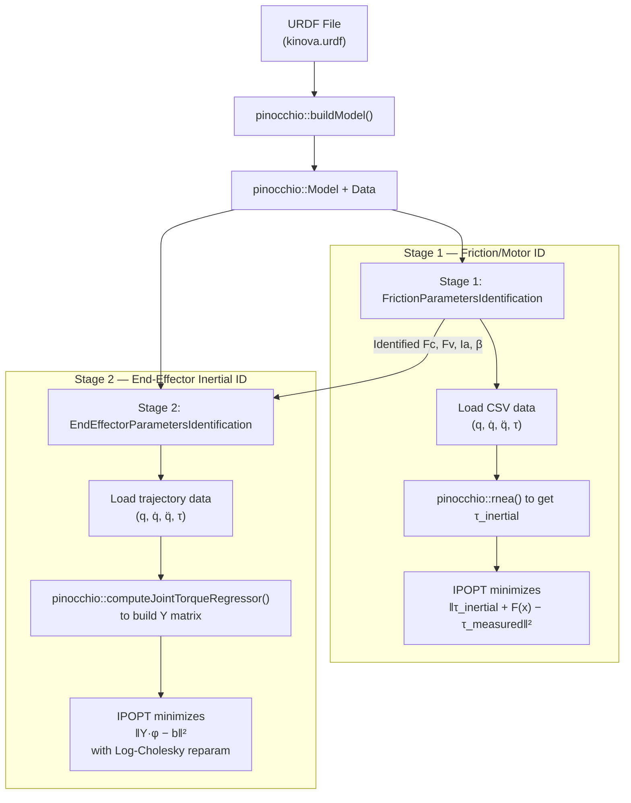
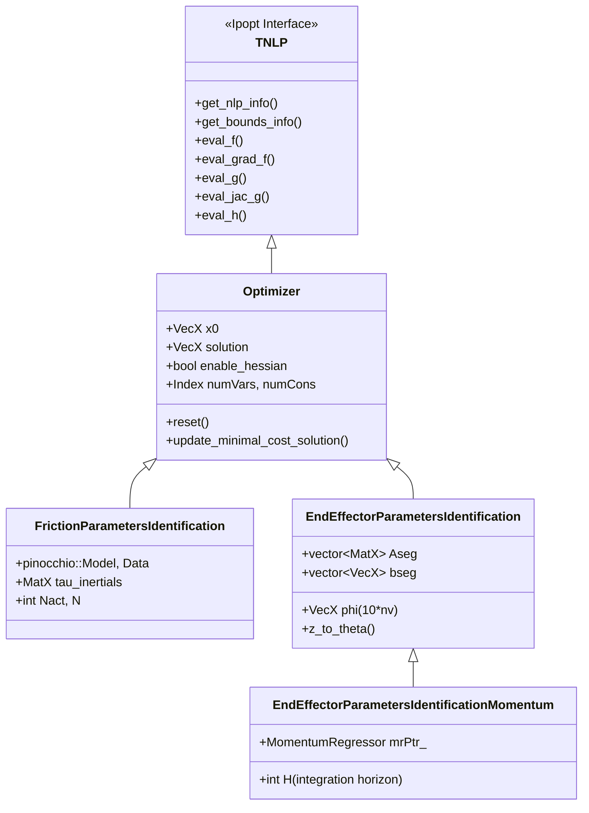

# RAPTOR C++ System Identification Pipeline — Full Walkthrough

## 0. Full Pipeline Execution Flow (How to Actually Run System ID)

> [!NOTE]
> Friction ID is done once during robot commissioning. EE Inertial ID is re-done each time a new payload is attached (quick calibration before a task).

```
Step 0 (one-time): Design exciting (exciting here means which keeps the regressor matrix conditioning number as less as possible, friction sinusoidal is not exciting in that sense, since no regressor matrix there) trajectory
    → C++: KinovaRegressorExample      (outputs exciting-trajectory.csv)
    → For Go1: need to adapt or skip (use sinusoidal directly?)

Step 1: Collect trajectory data
    → Simulation: 
        - For friction, its sysid_friction_trajectory_generator.py (Python, pinocchio sim)
        - For inertia, TODO: Need to generate exciting trajectories, previously was done using ARMOUR for Kinove to satisfy safety constraints, joint limits, and minimizing conditioning number. I do not care for safety constraints here. Need to find code, to see how this is generated. 
    → Hardware:   play exciting trajectory on robot, record LowState at 500 Hz
    → Filter + downsample → q, q_d, q_dd, tau CSVs ("q_downsampled_N.csv" etc.)

Step 2: Run Friction ID  [OFFLINE, C++ binary]
    → C++:   TestFrictionParametersIdentification <N>
    → Input:  q_downsampled_N.csv, q_d_downsampled_N.csv,
              q_dd_downsampled_N.csv, tau_downsampled_N.csv
    → Output: friction_parameters_solution_N.csv
              [Fc_1..Fc_n, Fv_1..Fv_n, Ia_1..Ia_n]
        
Step 3: Run Inertial ID  [C++ binary OR Python wrapper]
    → C++:    TestEndEffectorParametersIdentification (synthetic data only, for testing)
    → C++:    TestEndEffectorParametersIdentificationMomentum (hardware .txt files)
    → Python: test_sysid_inverse_dynamics.py via end_effector_sysid_nanobind wrapper (Optional, can do directlty the C++ files)
    → Input:  traj_data.csv + acceleration_filtered.csv + friction_params.csv
    → Output: end-effector inertial parameters [m, hx, hy, hz, Ixx...Izz]
```


> [!IMPORTANT]
> `TestEndEffectorParametersIdentification` does NOT load from CSV files — it generates **synthetic trajectory data internally** using `BezierCurves` ([L25-46](file:///Users/akshunn/ROAHM%20Lab/RAPTOR/Examples/Unitree-Go1/SystemIdentification/ParametersIdentification/TestEndEffectorParametersIdentification.cpp#L25-L46)). It is a **unit test / validation file** only. The real hardware data loading happens in `TestEndEffectorParametersIdentificationMomentum` via `.txt` hardware trajectory files.

### Hardware Inertial ID: CSV vs TXT Clarification

The exciting trajectory CSV and hardware `.txt` file serve **different roles**:

| File | Origin | What it is |
|---|---|---|
| `exciting-trajectory.csv` | `KinovaRegressorExample` output | **COMMAND**: designed trajectory `[time, q_desired, q_d_desired, tau_feedforward]`. Sent to robot controller. |
| `2024_11_17_no_gripper_id_N.txt` | Real robot hardware logger | **MEASUREMENT**: what robot actually did `[time, q_actual, q_d_actual, tau_actual]`. Logged by Kinova SDK during execution. |

The hardware inertial ID workflow is:
```
1. Run KinovaRegressorExample → exciting-trajectory.csv   (designed command)
2. Upload CSV to robot controller → robot executes trajectory with payload attached
3. Hardware logger records actual states → saves as .txt                (measured data)
4. TestEndEffectorParametersIdentificationMomentum reads .txt → identifies φ_EE
```

The code at [L40-42](file:///Users/akshunn/ROAHM%20Lab/RAPTOR/Examples/Unitree-Go1/SystemIdentification/ParametersIdentification/TestEndEffectorParametersIdentificationMomentum.cpp#L40-L42) shows the CSV option is commented out — it was used for simulation/debugging only. Measured `.txt` data is preferred because it contains real friction, noise, and tracking errors that improve identification accuracy.

---

## 1. Big Picture: Two Pipelines, Two Projects

You're looking at **two separate sys ID codebases** that solve the same fundamental problem — identifying a robot's dynamic parameters from trajectory data — but for different robots and with different design philosophies:

| Aspect | **RAPTOR** (C++) | **ConstrainedSysID** (MATLAB) |
|---|---|---|
| Robot | Kinova Gen3 manipulator | Digit humanoid / Go1 leg |
| Robot model | Auto-generated from **URDF via Pinocchio** | **Hand-built** in `Go1Leg_model.m` using `spatial_v2` |
| Regressor | `pinocchio::computeJointTorqueRegressor()` | `RegressorClassical.m` (RNEA-based, by hand) |
| Optimizer | **IPOPT** (C++ NLP solver) | **fmincon** (MATLAB SQP) |
| Constraints | Baked into reparameterization (unconstrained NLP) | Explicit LMI + bounds in fmincon |
| Two-stage? | **Yes**: Friction ID → EE Inertial ID | **Combined**: identifies all params jointly (`SearchAll=true`) |

> [!IMPORTANT]
> The C++ RAPTOR pipeline splits the identification into **two sequential optimizations**. MATLAB ConstrainedSysID typically does it **in one shot** (`SysIDAlgFull`). This is the biggest structural difference.

---

## 2. RAPTOR Pipeline Architecture



---

## 3. Stage 1: Friction Parameters Identification

### What it identifies
The motor-side parameters: `Fc` (Coulomb friction), `Fv` (viscous damping), `Ia` (armature/rotor inertia), and optionally `β` (offset/bias).

### MATLAB equivalent
In ConstrainedSysID, these are `X_fm = [Im_1, Im_2, Im_3, Fc_1, Fv_1, Fc_2, Fv_2, Fc_3, Fv_3]` in [SysIDMain.m:L83-88](file:///Users/akshunn/ROAHM%20Lab/system_id/ConstrainedSysID/SysIDMain.m#L83-L88).

> **MATLAB equivalent**: `SysIDData.m` calls `dataProcessing()` which filters and resamples the raw data, then stores it as rows of `[q; qdot; qddot; torq]`. The C++ version expects pre-processed CSV files — the filtering happens offline.

**Step 2: Compute inertial torque** ([FrictionParametersIdentification.cpp:L44-54](file:///Users/akshunn/ROAHM%20Lab/RAPTOR/Examples/Kinova/SystemIdentification/ParametersIdentification/src/FrictionParametersIdentification.cpp#L44-L54))
```cpp
// For each timestep, compute τ_inertial = RNEA(q, q̇, q̈) using Pinocchio
pinocchio::rnea(*modelPtr_, *dataPtr_, q, v, a);
tau_inertials.col(i) = dataPtr_->tau;
// tau_inertials is MatX (nv × N): columns = timesteps, rows = joints
```

> **MATLAB equivalent**: In the MATLAB pipeline, `RegressorClassical.m` computes the full regressor `W_ip * phi` which includes inertial torques. The C++ version uses Pinocchio's RNEA directly — **this is the key advantage**: you don't need to hand-derive RNEA for each robot.

**Step 3: Objective function** ([FrictionParametersIdentification.cpp:L140-182](file:///Users/akshunn/ROAHM%20Lab/RAPTOR/Examples/Kinova/SystemIdentification/ParametersIdentification/src/FrictionParametersIdentification.cpp#L140-L182))

The friction model is: `τ = τ_inertial + Fc·sign(q̇) + Fv·q̇ + Ia·q̈ + β`

```cpp
// Decision variable z is laid out as: [Fc_1..Fc_n | Fv_1..Fv_n | Ia_1..Ia_n | (β_1..β_n)]
VecX friction = z.head(Nact);           // Fc: static/Coulomb friction
VecX damping  = z.segment(Nact, Nact);  // Fv: viscous damping
VecX armature = z.segment(2*Nact, Nact);// Ia: armature/rotor inertia
// Objective: min Σ_i ½‖τ_estimated(i) − τ_measured(i)‖²
```

> **MATLAB equivalent**: Same math in `SysIDAlgFull.m`, but combined with inertial params. In MATLAB, the decision variable packs `[X_ip; X_fm]` as one vector — inertial params first, then friction/motor. C++ separates them into two distinct optimization problems.

### Key data types

| C++ Type | What it is | Size |
|---|---|---|
| `pinocchio::Model` | Robot kinematic/dynamic model parsed from URDF | (opaque) |
| `pinocchio::Data` | Workspace for algorithms (like RNEA) | (opaque) |
| `MatX` = `Eigen::MatrixXd` | Dynamic-size double matrix | varies |
| `VecX` = `Eigen::VectorXd` | Dynamic-size double vector | varies |
| `std::shared_ptr<MatX>` | Shared ownership pointer to a matrix | (pointer) |
| `Index` | Ipopt's integer type (`int`) | 4 bytes |
| `Number` | Ipopt's scalar type (`double`) | 8 bytes |

### NLP structure (No bias if I am correct)
- **Decision variables**: `3*Nact` (or `4*Nact` with offset) — per joint: `[Fc, Fv, Ia, (β)]`
- **Constraints**: `m = 0` (none!)
- **Variable bounds**: `Fc ∈ [0,50]`, `Fv ∈ [0,50]`, `Ia ∈ [0,50]`, `β ∈ [-50,50]`
- **Objective**: quadratic least-squares → **exact Hessian is provided** (constant w.r.t. x!)

> **MATLAB equivalent**: In MATLAB's fmincon, these would be `lb_fm` and `ub_fm` in [SysIDMain.m:L110-121](file:///Users/akshunn/ROAHM%20Lab/system_id/ConstrainedSysID/SysIDMain.m#L110-L121).

---

## 4. Stage 2: End-Effector Inertial Parameters Identification

### What it identifies
The 10 dynamic parameters of the **last link** (end-effector/payload): `[m, hx, hy, hz, Ixx, Ixy, Iyy, Ixz, Iyz, Izz]`.

### Why only the last link?
The assumption is that the rest of the robot's inertial parameters are **already known** (from the URDF or a prior whole-body identification). Only the end-effector is unknown — e.g., a new gripper or payload was attached.

### MATLAB equivalent
In ConstrainedSysID with `SearchAll=true`, inertial params for ALL links are identified simultaneously (`X0_ip` in [SysIDMain.m:L64-74](file:///Users/akshunn/ROAHM%20Lab/system_id/ConstrainedSysID/SysIDMain.m#L64-L74)). The C++ version is **more targeted** — it only touches the last link.

### Key files

| C++ File | Role |
|---|---|
| [TestEndEffectorParametersIdentification.cpp](file:///Users/akshunn/ROAHM%20Lab/RAPTOR/Examples/Kinova/SystemIdentification/ParametersIdentification/TestEndEffectorParametersIdentification.cpp) | **Driver** (synthetic data test) |
| [EndEffectorParametersIdentification.h](file:///Users/akshunn/ROAHM%20Lab/RAPTOR/Examples/Kinova/SystemIdentification/ParametersIdentification/include/EndEffectorParametersIdentification.h) | Class declaration |
| [EndEffectorParametersIdentification.cpp](file:///Users/akshunn/ROAHM%20Lab/RAPTOR/Examples/Kinova/SystemIdentification/ParametersIdentification/src/EndEffectorParametersIdentification.cpp) | NLP callbacks + Log-Cholesky parameterization |


**Step 3: The Log-Cholesky parameterization** ([EndEffectorParametersIdentification.cpp — z_to_theta](file:///Users/akshunn/ROAHM%20Lab/RAPTOR/Examples/Kinova/SystemIdentification/ParametersIdentification/src/EndEffectorParametersIdentification.cpp#L272-L305))

This is the **most important difference** from the MATLAB approach. Instead of adding LMI constraints to ensure physical consistency (positive mass, positive-definite inertia tensor), the C++ version uses a **change of variables** that makes **any** value of `z ∈ ℝ¹⁰` produce a physically valid set of parameters:

```
z = [α, d₁, d₂, d₃, s₁₂, s₂₃, s₁₃, t₁, t₂, t₃]  ← 10 unconstrained optimization variables

θ = z_to_theta(z)  → 10 physically-consistent dynamic parameters
```

The mapping constructs a pseudo-inertia matrix that is **positive semi-definite by construction**:
- Mass: `m = exp(2α)` → always > 0
- First moments: `h = exp(2α) · [t₁, t₂, t₃]` → unrestricted (CoM can be anywhere)
- Inertia tensor diagonal: uses `exp(d_i)²` terms → always > 0
- Inertia tensor off-diagonal: built from `s_ij` and `t_i` cross-terms

> [!TIP]
> This is from the paper by **Rucker & Wensing (2022)**, "Smooth Parameterization of Rigid-Body Inertia" (IEEE RA-L). The key insight: instead of constrained optimization, reparameterize so the feasible set is all of ℝⁿ.

> **MATLAB equivalent**: ConstrainedSysID uses **explicit LMI constraints** in `fmincon` to enforce physical consistency (`includeConstraints = true`, `constraintVariant`). The C++ approach is mathematically cleaner but harder to extend to all links simultaneously.

**Step 4: Objective function** ([EndEffectorParametersIdentification.cpp — eval_f](file:///Users/akshunn/ROAHM%20Lab/RAPTOR/Examples/Kinova/SystemIdentification/ParametersIdentification/src/EndEffectorParametersIdentification.cpp#L184-L204))
```cpp
// Only the LAST 10 entries of phi are optimized (end-effector)
phi.tail(10) = z_to_theta(z);  // For entire leg sysid, I can change this from last 10 to entire leg inertial paramaeters. 
// Objective: Σ_segments ½‖A * φ − b‖²
for (Index i = 0; i < Aseg.size(); i++) {
    const VecX diff = Aseg[i] * phi - bseg[i];
    obj_value += 0.5 * diff.dot(diff);
}
```

### NLP structure
- **Decision variables**: 10 (the `z` vector for the end-effector)
- **Constraints**: `m = 0` (none! feasibility is via reparameterization)
- **No variable bounds** (all of ℝ¹⁰ is feasible)
- **Exact Hessian provided** via `dd_z_to_theta` — Gauss-Newton + second-order correction terms

---

## 5. Stage 2b: Momentum-Based End-Effector ID (Alternative, and Prefereable)

[EndEffectorParametersIdentificationMomentum](file:///Users/akshunn/ROAHM%20Lab/RAPTOR/Examples/Kinova/SystemIdentification/ParametersIdentification/include/EndEffectorParametersIdentificationMomentum.h) is a subclass of `EndEffectorParametersIdentification` that uses **momentum dynamics** instead of inverse dynamics:

```
H(q)·q̇ = Y_momentum · φ     (momentum = regressor × params)
```

**Key advantage**: No need to estimate joint accelerations `q̈`, which are very noisy in practice. Instead, it integrates the dynamics:

```
∫(τ - C^T·q̇) dt = H(q)·q̇ - H(q₀)·q̇₀
```

This uses the regressor classes in [KinematicsDynamics/](file:///Users/akshunn/ROAHM%20Lab/RAPTOR/KinematicsDynamics/):

| C++ Class | Role | MATLAB equivalent |
|---|---|---|
| [RegressorInverseDynamics](file:///Users/akshunn/ROAHM%20Lab/RAPTOR/KinematicsDynamics/include/RegressorInverseDynamics.h) | Computes `τ = Y·φ` with analytical gradient `∂Y/∂z` | `RegressorClassical.m` |
| [MomentumRegressor](file:///Users/akshunn/ROAHM%20Lab/RAPTOR/KinematicsDynamics/include/MomentumRegressor.h) | Computes `H·q̇ = Y·φ` and `C^T·q̇ = Y_CTv·φ` | (no direct equivalent in ConstrainedSysID) |
| [IntervalMomentumRegressor](file:///Users/akshunn/ROAHM%20Lab/RAPTOR/KinematicsDynamics/include/IntervalMomentumRegressor.h) | Interval arithmetic version for robustness | (no equivalent) |

---

## 6. Go1 Friction Parameter Identification — Implementation Plan

### 6.1 Overview

**Goal**: Simulate a single Go1 leg, generate trajectory data with known friction, run the C++ friction ID solver to recover friction parameters, then validate that the identified parameters improve control tracking.

**Robot structure**: Go1 has 4 identical legs × 3 joints each = 12 actuated joints. We focus on **one leg** (e.g., FR = Front Right):

| Joint Index | Name | Axis | Range (rad) | Torque limit (N·m) |
|---|---|---|---|---|
| 0 | `1_FR_hip_joint` | Roll (x) | [-0.863, 0.863] | 23.7 |
| 1 | `1_FR_thigh_joint` | Pitch (y) | [-0.686, 4.501] | 23.7 |
| 2 | `1_FR_calf_joint` | Pitch (y) | [-2.818, -0.888] | 35.55 |


> 1. ✅ **[CHOSEN] Use the full model** but only excite 3 joints (freeze others at nominal) — simpler to implement but CSVs have 12 columns.
>
> **Decision**: Use option 1 (full model, freeze 9 joints). The C++ `TestFrictionParametersIdentification` doesn't care about which joints moved — it fits friction per-joint. Joints that don't move will have near-zero identified friction (which is fine since they didn't contribute data).

### 6.2 Phase 1 — Data Generation (Python Simulation)

> ✅ **COMPLETE** — Friction simulation data generated using `sysid_trajectory_generator.py --mode friction --leg FR` (per-leg URDF `go1_FR.urdf`, nv=3, all 3 joints excited simultaneously). Output at `full_params_data/friction/FR/` — 4 CSVs × 3 columns. Skip to §6.3.

**Script**: `test_friction_sysid_go1.py` (new file in `Examples/Unitree-Go1/python/`)

**Architecture**: Replicate `test_sysid_inverse_dynamics.py` structure with these key modifications:

#### 6.2.1 Trajectory Design

Multi-frequency sinusoidal per joint to excite different friction regimes:

```python
# Design within joint limits. q_center is the midpoint of the range.
# Amplitude must ensure q_center ± A stays within [q_lower, q_upper] with margin.

# FR hip:   center = 0.0,    safe amplitude = 0.7  (limits ±0.863)
# FR thigh: center = 1.9,    safe amplitude = 1.5  (limits [-0.686, 4.501])
# FR calf:  center = -1.85,  safe amplitude = 0.8  (limits [-2.818, -0.888])
```

Use different frequencies per joint to maximize excitation:

```python
def desired_trajectory_friction(t, joint_idx):
    """Generate exciting trajectory for a single joint."""
    centers = [0.0, 1.9, -1.85]
    amplitudes = [0.7, 1.5, 0.8]
    
    c = centers[joint_idx]
    A = amplitudes[joint_idx]
    
    # Multi-freq: low (Fc excitation) + mid (Fv) + high (Ia)
    qd    = c + A * (0.5*sin(0.5*t) + 0.3*sin(2.0*t) + 0.1*sin(7.0*t))
    qd_d  = A * (0.5*0.5*cos(0.5*t) + 0.3*2.0*cos(2.0*t) + 0.1*7.0*cos(7.0*t))
    qd_dd = A * (-0.5*0.25*sin(0.5*t) - 0.3*4.0*sin(2.0*t) - 0.1*49.0*sin(7.0*t))
    return qd, qd_d, qd_dd
```

#### 6.2.2 Forward Simulation with Friction

**Critical**: `pin.aba()` does NOT model friction. You must add it manually in the dynamics:

```python
def dynamics_with_friction(t, state, model, data, Fc_true, Fv_true, Ia_true):
    q = state[:nv]
    v = state[nv:]
    
    qd, qd_d, qd_dd = desired_trajectory_full(t, active_joint)
    tau_cmd = controller(q, v, qd, qd_d, qd_dd, active_joint)
    
    # Coulomb + viscous friction resist motion — subtract from commanded torque
    tau_friction = Fc_true * np.sign(v) + Fv_true * v
    tau_net = tau_cmd - tau_friction
    
    # ✅ [CHOSEN] Armature: set on model BEFORE calling ABA.
    # Pinocchio adds diag(Ia) to the joint-space inertia matrix natively.
    # Do NOT manually subtract Ia*a — that is physically wrong
    model.armature = Ia_true
    
    a = pin.aba(model, data, q, v, tau_net)
    
    return np.concatenate([v, a])
```

> [!IMPORTANT]
> **Armature inertia**: Pinocchio's `pin.aba()` **does** support `model.armature` natively! If you set `model.armature = Ia_true` before calling ABA, it automatically adds rotor inertia to the effective mass matrix. So you don't need to subtract `Ia * q̈` manually — just set the field. Only `Fc` and `Fv` need manual handling.

> [!IMPORTANT]
> **What torque to record**: Save `tau_cmd` (the motor command), **NOT** `tau_net`. On real hardware, the torque sensor reads the motor current → that is `tau_cmd`. The C++ friction ID solver does: `residual = tau_cmd - RNEA(q, v, a) - friction_model(v, a)`, and RNEA internally accounts for armature if set in the model. So the data pipeline expects the raw motor output.

> [!NOTE]
> **Hardware footnote — β (offset) parameter**: The full friction model has 4 terms per joint: `τ_friction = Fc·sign(q̇) + Fv·q̇ + Ia·q̈ + β`. In simulation, β = 0 (no sensor bias). On real hardware, β absorbs:
> - Torque sensor bias (reads non-zero at zero torque)
> - Asymmetric Coulomb friction (+ vs − direction not equal)
> - Residual gravity compensation error
> [!IMPORTANT]
> **To enable β identification on hardware**: set `include_offset_input = true` in `TestFrictionParametersIdentification.cpp` (L26). The decision variable grows from `3*Nact` to `4*Nact` (for Go1 full model: 36 → 48 variables). The output CSV will then contain `[Fc(12), Fv(12), Ia(12), β(12)]`. Do this only on real hardware — in simulation β = 0 always and identifying it adds unnecessary complexity. 

#### 6.2.4 Acceleration & Filtering

**Low-pass filter in simulation?** Not strictly needed (simulation is noise-free), but **recommended** for realism and to match the hardware pipeline:

```python
# Compute acceleration via central difference on velocity
accs, dt_acc = central_difference_4th_order(ts_sim, vs)

# Optional: filter if you want to mimic hardware workflow
# accs_filtered = butterworth_lowpass_filter(accs, cutoff=30, fs=1/dt)
accs_filtered = accs  # skip in sim
```

#### 6.2.5 Output Files

Save in the format `TestFrictionParametersIdentification` expects. Each CSV: `(N_timesteps × nv)` where `nv = 12` for full model:

```python
output_dir = "../Examples/Unitree-Go1/SystemIdentification/ParametersIdentification/friction_data/"
np.savetxt(output_dir + "q_downsampled_1.csv",    qs_ds,   delimiter=" ")
np.savetxt(output_dir + "q_d_downsampled_1.csv",  vs_ds,   delimiter=" ")
np.savetxt(output_dir + "q_dd_downsampled_1.csv", accs_ds, delimiter=" ")
np.savetxt(output_dir + "tau_downsampled_1.csv",   taus_ds, delimiter=" ")
```

### 6.3 Phase 2 — Friction ID (C++ Solver)

> [!IMPORTANT]
> ✅ Phase 1 COMPLETE — friction CSVs in `full_params_data/friction/FR/` (3-col, nv=3).
> ✅ `TestFrictionParametersIdentification.cpp` updated for per-leg (separate branch — **merge before running**).
> Next: `make Go1_SysidFriction_test -j4` then `./Go1_SysidFriction_test FR`

#### What the C++ solver does

Reads the 4 CSVs → runs IPOPT optimization → outputs `friction_parameters_solution_1.csv` containing `[Fc(12), Fv(12), Ia(12)]`.

The identified friction for the 11 frozen joints will be near-zero (they didn't move). The 1 active joint (e.g. j1 = FR Thigh) will have meaningful values close to `Fc_true, Fv_true, Ia_true` that were injected in simulation.

---


## 7. The Optimizer Base Class (IPOPT Interface)

All sys ID classes inherit from [Optimizer](file:///Users/akshunn/ROAHM%20Lab/RAPTOR/Optimization/include/Optimizer.h), which inherits from `Ipopt::TNLP`. This is the C++ interface to IPOPT.



The key methods each subclass **must** implement:

| IPOPT Method | What it does | MATLAB equivalent |
|---|---|---|
| `get_nlp_info()` | Returns # variables, # constraints | Problem dimensions in fmincon call |
| `get_bounds_info()` | Returns `lb`, `ub` for vars and constraints | `lb`, `ub` in `SysIDMain.m` |
| `eval_f()` | Computes objective value `f(x)` | Objective function handle in fmincon |
| `eval_grad_f()` | Computes gradient `∇f(x)` | `SpecifyObjectiveGradient` in fmincon |
| `eval_g()` | Computes constraint values `g(x)` | Constraint function handle |
| `eval_jac_g()` | Computes constraint Jacobian | `SpecifyConstraintGradient` in fmincon |
| `eval_h()` | Computes Hessian of Lagrangian | (fmincon uses BFGS by default) |

> [!TIP]
> The `Optimizer` base class provides default implementations for `eval_g`, `eval_jac_g`, `eval_h` that **delegate to subclass methods** `eval_f`, `eval_grad_f`, `eval_hess_f` and assemble the full Lagrangian Hessian. So the subclasses only need to provide objective-related callbacks.


---


### 8.1 Phase 2: Build & Run C++ Solver

**Inside the container — build:**
```bash
cd /workspaces/RAPTOR
mkdir build && cd build
cmake ..
make Go1_SysidFriction_test -j4    # only builds the one target, much faster
```

**Inside the container — run:**
```bash
# Must run from build/ because CSV paths in .cpp use "../Examples/..." relative to build/
cd /workspaces/RAPTOR/build
./Go1_SysidFriction_test 1         # "1" = reads *_1.csv files (joint 1 = FR Thigh)
```

**Expected output:**
```
Total solve time: ~50 milliseconds
parameter solution: [Fc_0 .. Fc_11  Fv_0 .. Fv_11  Ia_0 .. Ia_11]
```

**Output files written to:**
```
Examples/Unitree_Go1/SystemIdentification/ParametersIdentification/full_params_data/friction/joint/
    friction_parameters_solution_1.csv    ← 12 values: [Fc(3), Fv(3), Ia(3)]
    friction_estimate_tau_1.csv           ← reconstructed torque (for validation plot)
```

**To run for each joint:**
```bash
./Go1_SysidFriction_test FR 1   # FR Hip
```

#### Sanity check after running
Open `friction_parameters_solution_1.csv`. The values are laid out as:
```
[Fc_j0, Fc_j1, ..., Fc_j2,   ← first 3 rows: Coulomb friction per joint
 Fv_j0, Fv_j1, ..., Fv_j2,   ← next 3 rows: viscous damping per joint
 Ia_j0, Ia_j1, ..., Ia_j2]   ← last 3 rows: armature inertia per joint
```

---

### 8.4 Phase 3 — Validation via IDC Tracking Comparison

**Goal**: Show that identified friction parameters improve control performance.

#### 8.4.1 Why IDC for Validation (Not PD)

Simple PD: `τ = Kp·e + Kd·ė` → tracking quality depends on **gains**, not model quality. A lucky gain choice can mask bad parameters.

IDC (Inverse Dynamics Control / Computed Torque):
```
τ = M̂(q)·(q̈_d + Kd·ė + Kp·e) + Ĉ(q,q̇)·q̇ + ĝ(q) + F̂c·sign(q̇) + F̂v·q̇
         └─── PD on error ────┘    └──── model-based cancellation ──────────┘
```

If `M̂, Ĉ, ĝ, F̂c, F̂v` are perfect → tracking error converges to zero (linear dynamics).
If `M̂, Ĉ, ĝ, F̂c, F̂v` are wrong → residual nonlinear dynamics → tracking error grows.

**This directly exposes model quality.** The controller performance becomes a proxy for parameter accuracy.

#### 8.4.2 Two Scenarios to Compare

Simulate tracking a **NEW** sinusoidal trajectory (different frequencies from the one used for identification!) under two parameter sets:

```
Scenario A: IDC with true friction parameters (Fc_true, Fv_true, Ia_true)
            → best possible tracking (perfect model)

Scenario B: IDC with identified friction parameters from Phase 2 (Fc_estimated, Fv_estimated, Ia_estimated)
            → should be close to A if the optimizer recovered good parameters
```

The "ground truth simulator" always uses the true parameters — the true model generates the actual robot states. The IDC controller uses whichever parameter set is being tested.


#### 8.4.3 IDC Implementation

```python
def idc_controller(q, v, qd, qd_d, qd_dd, model_hat, data_hat, Fc_hat, Fv_hat):
    """Inverse dynamics control using estimated model parameters."""
    e = qd - q
    e_d = qd_d - v
    a_desired = qd_dd + Kd * e_d + Kp * e   # desired acceleration
    
    # Compute model-based feedforward using ESTIMATED model
    tau_ff = pin.rnea(model_hat, data_hat, q, v, a_desired)
    
    # Add friction compensation using ESTIMATED friction
    tau_friction_comp = Fc_hat * np.sign(v) + Fv_hat * v
    
    return tau_ff + tau_friction_comp
```

#### 8.4.4 Validation Metrics

```python
# For each scenario, compute:
tracking_error = np.linalg.norm(q_actual - q_desired, axis=1)  # per timestep
rmse = np.sqrt(np.mean(tracking_error**2))
max_error = np.max(tracking_error)
```

Expected results:
```
RMSE(A) ≈ 0.001  (near-perfect, limited by Kp/Kd)
RMSE(B) ≈ RMSE(A)  (identified params ≈ true params → good tracking)
```

If `RMSE(B) >> RMSE(A)`, the identification failed — go back and check data quality.

TODO:
1. Implement the tracking error metric.
2. Review the forward tracking pipeline.
3. Run the optimization 5 times for every joint. Report the tracking error for this averaged data and the reported friction parameters with the mean error and standard deviation.

## 9. C++ Best Practices:  Porting Kinova Example Modules to Unitree Go1

When porting a copied module (e.g., `CollisionAvoidanceTrajectory` or `CollisionAvoidanceInverseKinematics`) from the Kinova folder to Go1, follow this checklist to prevent compilation/namespace conflicts and ensure correct indexing.

### 9.1 Namespace Isolation
By default, the copied files will declare classes inside the `RAPTOR::Kinova` or `RAPTOR::Kinova::Armour` namespace. To prevent duplicate definition (ODR) errors:
1. Rename all instances of `namespace Kinova` and `using namespace Kinova;` to `namespace Go1` and `using namespace Go1;`.
2. Run these commands in the terminal targeting the subfolder:
   ```bash
   find /workspaces/raptor/Examples/Unitree_Go1/<SubfolderName>/ -type f \( -name "*.h" -o -name "*.cpp" \) -exec sed -i 's/namespace Kinova/namespace Go1/g' {} +
   find /workspaces/raptor/Examples/Unitree_Go1/<SubfolderName>/ -type f \( -name "*.h" -o -name "*.cpp" \) -exec sed -i 's/using namespace Kinova;/using namespace Go1;/g' {} +
   find /workspaces/raptor/Examples/Unitree_Go1/<SubfolderName>/ -type f \( -name "*.h" -o -name "*.cpp" \) -exec sed -i 's/Kinova::Armour/Go1::Armour/g' {} +
   ```

### 9.2 Constants Namespace & File Updates
Kinova constants are declared in `KinovaConstants.h`. If you port a folder:
1. Make sure `Go1Constants.h` is created with `namespace RAPTOR { namespace Go1 { ... } }`.
2. Replace includes in your ported files:
   ```diff
   -#include "KinovaConstants.h"
   +#include "Go1Constants.h"
   ```

### 9.3 CMake Targets Setup
Declare separate library, executable, and nanobind modules in `/workspaces/raptor/Examples/Unitree_Go1/CMakeLists.txt` using the `Go1` prefix instead of `Kinova`.

For example, to compile Go1 Armour:
```cmake
# Go1 Armour Library
add_library(Go1Armourlib SHARED
    Armour/src/PZSparse.cpp
    Armour/src/RobotInfo.cpp
    ...
)

# Go1 Armour Executable Example
add_executable(Go1Armour_example Armour/ArmourExample.cpp)
target_link_libraries(Go1Armour_example PUBLIC Go1Armourlib ...)

# Go1 Python Bindings
nanobind_add_module(go1_armour_nanobind NB_SHARED LTO ...)
```

### 9.4 URDF & YAML Configurations
In the ported C++ example driver files (e.g. `ArmourExample.cpp`), update the loaded assets to point to the Go1 URDF model and YAML configurations:
```cpp
const std::string robot_model_file = "../Robots/unitree-go1/go1.urdf";
const std::string robot_info_file = "../Examples/Unitree_Go1/Armour/Go1Info.yaml";
```

---

## 10. Per-Leg SysID — Final Architecture (Fixed Base)

> [!IMPORTANT]
> **Physical setup decision**: The robot trunk is **C-clamped to a rigid table**. This makes the base truly fixed, completely decoupling all leg branches from each other. Inactive legs can be in any configuration (hanging, roped, free) and require **no motor torques and no controller**. The simulation uses only the active leg's 3-DOF per-leg URDF for both friction and inertial SysID.

### 10.1 Why fixed base decouples inactive legs

For an open kinematic chain with a **truly fixed base**, the Newton-Euler equations for the active leg (e.g., FR) are:

```
τ_FR = M_FR(q_FR) · q̈_FR + C_FR(q_FR, q̇_FR) + g_FR(q_FR)
```

FL, RR, RL joint variables appear **nowhere** in this expression. They are on separate branches and are entirely absent from the FR regressor. Whatever the inactive legs do physically — hang free, swing, be roped — it has **zero effect** on the identified FR parameters.

> [!NOTE]
> This is a property of open kinematic chain **+** fixed base together. Open chain alone is not sufficient; the fixed base is the key condition. A C-clamp on the trunk satisfies this exactly.

---

### 10.2 Physical Setup

```
         ┌────────────────────────────────┐
         │       RIGID TABLE              │
         │   FL (free/resting)  ║  FR (active, hangs off edge)
         │   ──────────────────[TRUNK]────────────── → RIGHT EDGE
         │   RL (free/resting)  ║  RR (hangs, roped or free)
         │              C-CLAMP ↕ (trunk bolted here)
         └────────────────────────────────┘
```

- **Trunk**: C-clamped rigidly to table → truly fixed base
- **FR**: hangs freely, executes exciting trajectory (or sinusoidal for friction)
- **RR**: hangs on same side — free or roped — **irrelevant to model**
- **FL, RL**: resting on table — **irrelevant to model**
- **No motor torques needed on FL, RR, RL**

---

### 10.3 Architecture

Both friction and inertial SysID follow the same pipeline. The only difference is the trajectory source for the active leg.

```
                    ┌──────────────────────────────────┐
                    │  Go1_RegressorExample.cpp (C++)   │
                    │  Input:  go1_FR.urdf (nv=3)       │
                    │  Role:   Design optimal exciting   │
                    │          trajectory offline        │
                    │  Output: exciting-traj-1.csv       │
                    └────────────────┬─────────────────┘
                                     │ (inertial mode only)
┌────────────────────────────────────▼────────────────────────────┐
│  sysid_trajectory_generator.py  (Python, 3-DOF simulation)      │
│                                                                  │
│  --mode friction  --leg FR  --joint 0  (TODO: Not required, since we doing simultaneous  datagen)                                                           │
│    Model:    go1_FR.urdf (nv=3)   ← fixed base                  │
│    Traj:     multi-freq sinusoid for joint 0 (or 1, or 2)        │
│    Inactive: not in model at all                                  │
│    Output:   full_params_data/friction/FR/                        │
│                                                                  │
│  --mode inertial  --leg FR  --run 1                              │
│    Model:    go1_FR.urdf (nv=3)   ← fixed base                  │
│    Traj:     load exciting-trajectory-1.csv, replay via PD       │
│    Inactive: not in model at all                                  │
│    Output:   full_params_data/inertial/FR/                       │
└────────────────────────────────────┬────────────────────────────┘
                                     │
               ┌─────────────────────┴─────────────────────┐
               │                                           │
  ┌────────────▼──────────────┐           ┌───────────────▼───────────────┐
  │  FrictionParametersID     │           │  EndEffectorParametersID       │
  │  (C++, go1_FR.urdf)       │           │  (C++, go1_FR.urdf)            │
  │  Input:  friction/ CSVs   │           │  Input:  inertial/ CSVs        │
  │  Output: Fc, Fv, Ia (×3)  │           │  Output: inertial params (×3)  │
  └───────────────────────────┘           └────────────────────────────────┘
```


---

### 11.6 CSV output format (both modes, nv=3)

One simulation run → four CSV files, each with **3 columns** (one per active joint):

```
full_params_data/<mode>/<leg>/
    q_downsampled.csv        (N_samples × 3)
    q_d_downsampled.csv      (N_samples × 3)
    q_dd_downsampled.csv     (N_samples × 3)
    tau_downsampled.csv      (N_samples × 3)
```

The downstream C++ estimators (`FrictionParametersIdentification`, `EndEffectorParametersIdentification`) both expect `nv`-column inputs — they read `model.nv` from the URDF and expect that many columns. With `go1_FR.urdf`, `nv=3`, so 3-col CSVs are correct.


---

### 11.9 Task 3 — Refactor `sysid_trajectory_generator.py`

```bash
# Friction SysID — all 3 joints of FR leg simultaneously:
python3 sysid_trajectory_generator.py --mode friction --leg FR

# Inertial SysID — replay optimized exciting trajectory for FR:
python3 sysid_trajectory_generator.py --mode inertial --leg FR --run 1
```

---

### 11.11 Open Questions

2. **Hip identifiability**: Hip is a pure abduction joint. Its regressor rows may be poorly conditioned — may need higher amplitude or frequency for the hip DOF in the exciting trajectory.

3. **Friction frequency selection**: The three joint sinusoid frequencies (`FREQS = [0.5, 1.0, 1.5]` Hz) should be chosen to avoid harmonic relationships (e.g., avoid 0.5/1.0/2.0 where joint 3 is a harmonic of joint 1). Incommensurate frequencies give a better-conditioned friction regressor.

## 12. Exciting Trajectory Regressor Configuration — Key Findings (Go1 FR Leg)

### 30-col vs 10-col, N=100, NO rankIdx fix

| | **30-column** `(NB-3)*10, width=30` | **10-column** `(NB-1)*10, width=10` |
|---|---|---|
| **What it covers** | All 3 links: hip + thigh + calf | Calf link only |
| **Y matrix shape** | 300 × 30 | 300 × 10 |
| **sigma[last]** | sigma[29] = **0 (exactly)** | sigma[9] = **7.8e-18 (float artifact)** |
| **log(sigmaMin)** | log(0) = **−∞ → NaN** | log(7.8e-18) = −39.4 (finite) |
| **Gradient** | **NaN** | 1/7.8e-18 = 1.3e17 (huge but finite) |
| **Iterations** | **0** | 196 |
| **Exit** | ❌ Invalid number (NaN crash) | ⚠️ Error in step computation |
| **Solution found** | **None** | 38.4258 (barely, poor quality) |

### Why they differ

The 30-col version has **structurally zero columns** (col[0,1,5-10], col[12], col[14,17,19], col[24,27,29]) which produce Eigen-exact zeros in the SVD. `log(0) = −∞` → NaN gradient → IPOPT aborts at iter 0.
```
=== EndeffectorY debug (shape 300x30) ===
Column L2 norms:
  col[0] = 0  <-- ZERO
  col[1] = 0  <-- ZERO
  col[2] = 94.5257
  col[3] = 26.2394
  col[4] = 0.305395
  col[5] = 0  <-- ZERO
  col[6] = 0  <-- ZERO
  col[7] = 0  <-- ZERO
  col[8] = 0  <-- ZERO
  col[9] = 0  <-- ZERO
  col[10] = 0  <-- ZERO
  col[11] = 34.6074
  col[12] = 0  <-- ZERO
  col[13] = 129.123
  col[14] = 0.0102768
  col[15] = 0.122534
  col[16] = 0.982778
  col[17] = 0.0650968
  col[18] = 0.414147
  col[19] = 0.0102768
  col[20] = 27.5012
  col[21] = 159.161
  col[22] = 0.0882134
  col[23] = 38.3287
  col[24] = 0.0105288
  col[25] = 0.52179
  col[26] = 1.60923
  col[27] = 0.0809114
  col[28] = 0.0867965
  col[29] = 0.0105288
```

The 10-col version has sigma[9] = 7.8e-18, a **floating-point rounding artifact** from Eigen's SVD, not a true structural zero. Tiny but finite → IPOPT survives 196 iterations with an exploding gradient (~1e17) but still fails to converge cleanly.

### The fix: `rankIdx`

Walk backward from `lastRow` to find the smallest **non-near-zero** singular value:
```cpp
const double tol = 1e-6 * sigmaMax;
size_t rankIdx = lastRow;
while (rankIdx > 0 && singularValues(rankIdx) < tol) { rankIdx--; }
const double &sigmaMin = singularValues(rankIdx); // sigma[16] = 0.0194 for 30-col
```
## Why Certain Regressor Columns Are Structurally Zero

When examining the 30-column regressor debug output, several columns are identically zero for all timesteps. These are not numerical artifacts — each has a precise geometric reason.

### Hip link (cols 0–9, x-axis joint)

| Col | Parameter | Norm | Reason |
|-----|-----------|------|--------|
| 0 | m_hip | 0 | The "m" column = unit mass at joint origin. The hip joint origin is a **fixed pivot** (attached to trunk). A mass at a fixed pivot has zero velocity, zero acceleration, zero moment arm → zero torque everywhere. |
| 1 | mcx_hip | 0 | For an x-axis joint: `τ_hip_x = (r×F)_x = cy·Fz - cz·Fy`. **cx never appears** in the x-axis cross-product projection, regardless of trajectory. (URDF: cx = -0.005657 m ≠ 0, but still zero in regressor.) |
| 5–9 | Ixy,Ixz,Iyy,Iyz,Izz | 0 | Hip link only has x-axis rotation (no parent joints), so ωy=ωz=0. Then `(I·α)_x = Ixx·αx` and `(ω×I·ω)_x = 0`. **Only Ixx survives.** |

### Thigh link (cols 10–19, y-axis joint)

| Col | Parameter | Norm | Reason |
|-----|-----------|------|--------|
| 10 | m_thigh | 0 | Unit mass at thigh joint origin: zero moment arm about the thigh joint itself; specific Go1 geometry makes its contribution to hip torque negligible. |
| 12 | mcy_thigh | 0 | **mcy is invisible to y-axis joints** (`(r×F)_y = cz·Fx - cx·Fz`, cy absent). Thigh and calf joints (both y-axis) cannot sense this parameter. Hip (x-axis) has weak coupling due to kinematic geometry. |
| 14,19 | Ixx,Izz | equal | Sagittal-plane motion (y-axis chain) mixes Ixx and Izz symmetrically via `R·I·R^T`. Only `Ixx-Izz` is distinguishable. |

### General rule

- **x-axis joint**: cannot sense `mcx` (along rotation axis), `Iyy`, `Izz`, off-diagonal inertias when ωy=ωz=0
- **y-axis joint**: cannot sense `mcy` (along rotation axis), `Ixx-Izz` individually (only their difference)
- **Mass `m` at joint origin**: always zero contribution (fixed pivot for base link; zero moment arm at any joint)

This gives exactly **13 structural zeros** → rank 17 out of 30 for the Go1 FR leg.

---

## Handling Unidentifiable Parameters

The 13 zero-column parameters are **structurally unidentifiable from joint torque measurements alone** — no trajectory, however exciting, can recover them. This is a fundamental limit of the kinematic structure, not a deficiency of the optimizer.

### What "unidentifiable" means

Setting an unidentifiable parameter to any value produces **identical predicted torques**. Least-squares estimation returns an arbitrary result (or fails numerically). The optimizer (IPOPT) cannot improve the condition number in these directions — hence the 13 zero singular values.

### Strategies for these parameters

| Parameter | Recommended approach |
|-----------|---------------------|
| m_hip, Iyy_hip, Izz_hip | **Use URDF value** — only a housing link, small impact on dynamics |
| mcy_thigh | **Use URDF value** — extremely weak signal even at hip (x-axis) |
| Ixx_thigh, Izz_thigh individually | **Use URDF** or assume symmetry (Ixx≈Izz for sagittal links) |
| All 17 identifiable directions | **Estimate from exciting trajectory** ✓ |

### Alternative estimation methods (if URDF values are distrusted)

1. **Direct physical measurement**: bifilar pendulum → Iyy, Izz directly; balance test → CoM
2. **Tilted configuration**: rolling the robot to 90° hip roll swaps x↔z axes, making previously invisible parameters visible
3. **Floating-base identification**: whole-body dynamics with IMU + contact forces gives different observability
4. **Manufacturer CAD**: Unitree's URDF values come from solid-model mass properties — generally reliable for the unidentifiable subset

### Practical takeaway

The 17 identifiable parameters are the **only ones that affect torque prediction accuracy**. Unidentifiable parameters contribute zero to any torque by definition — so URDF values are perfectly adequate for them, and the system identification effort should focus entirely on the identifiable subspace.

---

## FEATURE (DONE): Full-Leg (30-param) Inertial ID + Tikhonov

Generalize `EndEffectorParametersIdentification` from last-link-only (tail-10) to the whole leg (30 params). **All changes live in the base class → momentum solver inherits them for free** (momentum does NOT override `z_to_theta`/`eval_*`/`get_nlp_info`).

### z → θ → φ flow (what is actually optimized)

```
IPOPT moves  z  ──z_to_theta──►  θ (one link, 10)  ──stack──►  φ (full model, 30)  ──►  cost = ½‖A·φ − b‖²
```

- **`z`** (10 per link) = Log-Cholesky coords = **the decision variable** (unconstrained, any z∈ℝⁿ is physical). `α=z[0]` is log-mass: `m=exp(2α)`, and α scales *every* θ component (→ why columns can't be cleanly dropped).
- **`θ`** = `z_to_theta(z)` = one link's 10 physically-consistent params `[m,mcx,mcy,mcz,Ixx,Ixy,Iyy,Ixz,Iyz,Izz]`. **Derived, never optimized.**
- **`φ`** (30) = full-model params; identified blocks = θ(z), rest = URDF. Fed to regressor. **Derived.**
- We optimize **only `z`**; θ,φ recomputed every `eval_f/grad/hess`. Log-Cholesky bakes physical consistency into the parameterization → unconstrained NLP (no LMIs).

### 10 → 30 generalization (base class)

`z_to_theta`/`d_z_to_theta`/`dd_z_to_theta` stay **10→10, unchanged** — just call per link in a loop. Build a **block-diagonal 30×30 `dtheta`** (three 10×10 blocks). Changes: `get_nlp_info` n=10→30; `x0` size 30; `eval_f/grad/hess` replace `phi.tail(10)`→full `phi`, `A.rightCols(10)`→full `A`, loop `ddtheta` over j<30 mapping `j→(link j/10, local j%10)`; `theta_solution` `Vec10`→`VecX(30)`.

### Rank deficiency fix = Tikhonov ridge (NOT column drop, NOT rankIdx)

30-col regressor is rank 17/30 (13 structural zeros, §12) → Hessian `H` singular → IPOPT undetermined in 13 dirs AND `LDLT` inversion blows up. `rankIdx`/SVD-skip does NOT transfer (that trick edits an SVD-metric cost; here cost is a *residual* that's flat, not blown-up — and ID must emit values for dead params, so a prior is mandatory). Column-drop fails because Log-Cholesky entangles z-coords. **Fix = add ridge to the cost** (one knob fixes IPOPT solve + LDLT + pins dead params to URDF):

```
```
- grad: `[Σ diffᵀA + λ(φ−φ_orig)]·dtheta`
- Hess: data-GN + data-curv + **`λ·dthetaᵀdtheta`** (the PD fixer, fills the 13 flat dirs) + `λ·Σ_j(φ−φ_orig)_j·ddtheta(j)`
- **Simpler variant** (recommended to start): ridge in z-space `½λ‖z − z_URDF‖²` → `grad += λ(z−z_URDF)`, `H += λI` (guaranteed PD); `z_URDF = LogCholesky⁻¹(φ_orig)` once in `set_parameters`.
- λ ≈ ε·trace(data GN)/30, ε∈[1e-6,1e-3]. Refinement: weighted `W=diag(1/φ_orig²)` for params spanning orders of magnitude.

### Momentum-only: uncertainty block

Generalizing `finalize_solution` uncertainty (tail-10→30): `A.rightCols(10)`→full A, `phi.tail(10)`→full phi, drop the "other-link" source (`A.leftCols(10*(nv-1))` now empty), `theta_uncertainty` `Vec10d`→`VecX(30)`. `p_z_p_eta` (=`H`) is rank-17 → needs λ to make LDLT clean. Uncertainty is rigorous only for momentum (no q̈; noise enters cleanly via `b`). IIDD needs q̈ which contaminates `A` itself (errors-in-variables) → stub uncertainty there.

### Suggested order
1. Validate plumbing+point estimates on **IIDD** (trivial `finalize_solution`, uses filtered q̈), full-30 + z-space ridge.
2. Port to **momentum** for hardware-grade + uncertainty.
Diagnostic: print column-norms/rank → confirm 17 identifiable match URDF tightly, 13 sit at URDF.

---
## IMPORTANT URDF INFO
Fixed joints are fused — the child's inertia is shifted to the parent's frame using the parallel axis theorem and added in. For FR_foot_joint (xyz="0 0 -0.213" in calf frame, foot CoM at its own origin):

m_lumped     = m_calf + m_foot         = 0.154 + 0.04 = 0.194 kg
com_lumped_z ≈ (0.154×−0.115 + 0.04×−0.213) / 0.194  ≈ −0.135 m
I_lumped     = I_calf + I_foot shifted by [0,0,−0.213] via parallel axis

The result: model has nv=3, 3 bodies (hip, thigh, calf), and calf's phi = lumped calf+foot parameters.

So when reidentifying calf parameters, need to reverse these parameters to get actual calf values. (Only for sanity check, pinnochio will always lump these parameters back)

## Logic for friction armature estimation
──────────────────────────┬──────────────────────────┬────────────────────────────────────────────────┐
│                           │       Hip / Thigh        │                      Calf                      │
├───────────────────────────┼──────────────────────────┼────────────────────────────────────────────────┤
│ effort (URDF)             │ 23.7 N·m                 │ 45.43 N·m                                      │
├───────────────────────────┼──────────────────────────┼────────────────────────────────────────────────┤
│ gear ratio                │ N = 6.22 (internal only) │ N = 6.22 × (45.43/23.7) = 6.22 × 1.917 ≈ 11.93 │
├───────────────────────────┼──────────────────────────┼────────────────────────────────────────────────┤
│ I_armature = I_rotor × N² │ 0.004330 kg·m²           │ 0.015911 kg·m²                                 │
└───────────────────────────┴──────────────────────────┴────────────────────────────────────────────────┘