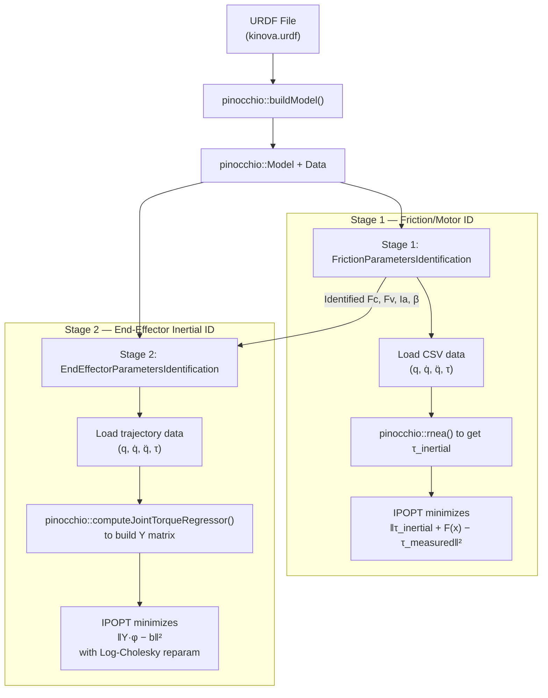
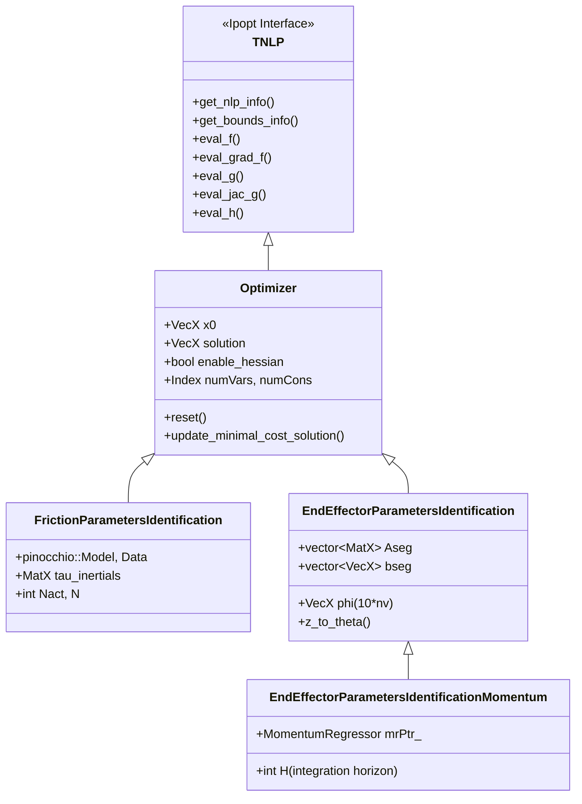

# RAPTOR C++ System Identification Pipeline — Full Walkthrough

> [!IMPORTANT]
> **User Preferences (always respect these):**
> - The user writes or copy-pastes ALL code themselves. Do **NOT** automatically write, edit, or run code files.
> - Act as a thinking partner and explainer. Generate code in the chatbox for copy-pasting only.
> - Building markdown artifacts is fine. Modifying `.cpp`, `.h`, `.py`, `.m`, or any source files directly is **not**.
> - Do not run terminal commands that execute or modify code without explicit user permission.

## 0. Full Pipeline Execution Flow (How to Actually Run System ID)

> [!NOTE]
> Both friction and inertial ID are **offline calibration procedures** — not real-time. Friction ID is done once during robot commissioning. EE Inertial ID is re-done each time a new payload is attached (quick calibration before a task, still offline).

```
Step 0 (one-time): Design exciting trajectory
    → C++: KinovaRegressorExample      (outputs exciting-trajectory.csv)
    → For Go1: need to adapt or skip (use sinusoidal directly)

Step 1: Collect trajectory data
    → Simulation: test_sysid_inverse_dynamics.py (Python, pinocchio sim)
    → Hardware:   play exciting trajectory on robot, record LowState at 500 Hz
    → Filter + downsample → q, q_d, q_dd, tau CSVs ("q_downsampled_N.csv" etc.)

Step 2: Run Friction ID  [OFFLINE, C++ binary]
    → C++:   TestFrictionParametersIdentification <N>
    → Input:  q_downsampled_N.csv, q_d_downsampled_N.csv,
              q_dd_downsampled_N.csv, tau_downsampled_N.csv
    → Output: friction_parameters_solution_N.csv
              [Fc_1..Fc_n, Fv_1..Fv_n, Ia_1..Ia_n]

Step 3: Run Inertial ID  [OFFLINE, C++ binary OR Python wrapper]
    → C++:    TestEndEffectorParametersIdentification (synthetic data only, for testing)
    → C++:    TestEndEffectorParametersIdentificationMomentum (hardware .txt files)
    → Python: test_sysid_inverse_dynamics.py via end_effector_sysid_nanobind wrapper
    → Input:  traj_data.csv + acceleration_filtered.csv + friction_params.csv
    → Output: end-effector inertial parameters [m, hx, hy, hz, Ixx...Izz]
```

> [!IMPORTANT]
> **No Python script exists for friction ID data generation** — this is a gap in the codebase. For Go1, you need to write a new Python simulation script that generates the 4 CSV files required by `TestFrictionParametersIdentification`.

> [!IMPORTANT]
> `TestEndEffectorParametersIdentification` does NOT load from CSV files — it generates **synthetic trajectory data internally** using `BezierCurves` ([L25-46](file:///Users/akshunn/ROAHM%20Lab/RAPTOR/Examples/Unitree-Go1/SystemIdentification/ParametersIdentification/TestEndEffectorParametersIdentification.cpp#L25-L46)). It is a **unit test / validation file** only. The real hardware data loading happens in `TestEndEffectorParametersIdentificationMomentum` via `.txt` hardware trajectory files.

### Hardware Inertial ID: CSV vs TXT Clarification

The exciting trajectory CSV and hardware `.txt` file serve **different roles**:

| File | Origin | What it is |
|---|---|---|
| `exciting-trajectory.csv` | `KinovaRegressorExample` output | **COMMAND**: designed trajectory `[time, q_desired, q_d_desired, tau_feedforward]`. Sent to robot controller. |
| `2024_11_17_no_gripper_id_N.txt` | Real robot hardware logger | **MEASUREMENT**: what robot actually did `[time, q_actual, q_d_actual, tau_actual]`. Logged by Kinova SDK during execution. |

The hardware inertial ID workflow is:
```
1. Run KinovaRegressorExample → exciting-trajectory.csv   (designed command)
2. Upload CSV to robot controller → robot executes trajectory with payload attached
3. Hardware logger records actual states → saves as .txt                (measured data)
4. TestEndEffectorParametersIdentificationMomentum reads .txt → identifies φ_EE
```

The code at [L40-42](file:///Users/akshunn/ROAHM%20Lab/RAPTOR/Examples/Unitree-Go1/SystemIdentification/ParametersIdentification/TestEndEffectorParametersIdentificationMomentum.cpp#L40-L42) shows the CSV option is commented out — it was used for simulation/debugging only. Measured `.txt` data is preferred because it contains real friction, noise, and tracking errors that improve identification accuracy.

---

## 1. Big Picture: Two Pipelines, Two Projects

You're looking at **two separate sys ID codebases** that solve the same fundamental problem — identifying a robot's dynamic parameters from trajectory data — but for different robots and with different design philosophies:

| Aspect | **RAPTOR** (C++) | **ConstrainedSysID** (MATLAB) |
|---|---|---|
| Robot | Kinova Gen3 manipulator | Digit humanoid / Go1 leg |
| Robot model | Auto-generated from **URDF via Pinocchio** | **Hand-built** in `Go1Leg_model.m` using `spatial_v2` |
| Regressor | `pinocchio::computeJointTorqueRegressor()` | `RegressorClassical.m` (RNEA-based, by hand) |
| Optimizer | **IPOPT** (C++ NLP solver) | **fmincon** (MATLAB SQP) |
| Constraints | Baked into reparameterization (unconstrained NLP) | Explicit LMI + bounds in fmincon |
| Two-stage? | **Yes**: Friction ID → EE Inertial ID | **Combined**: identifies all params jointly (`SearchAll=true`) |

> [!IMPORTANT]
> The C++ RAPTOR pipeline splits the identification into **two sequential optimizations**. MATLAB ConstrainedSysID typically does it **in one shot** (`SysIDAlgFull`). This is the biggest structural difference.

---

## 2. RAPTOR Pipeline Architecture



---

## 3. Stage 1: Friction Parameters Identification

### What it identifies
The motor-side parameters: `Fc` (Coulomb friction), `Fv` (viscous damping), `Ia` (armature/rotor inertia), and optionally `β` (offset/bias).

### MATLAB equivalent
In ConstrainedSysID, these are `X_fm = [Im_1, Im_2, Im_3, Fc_1, Fv_1, Fc_2, Fv_2, Fc_3, Fv_3]` in [SysIDMain.m:L83-88](file:///Users/akshunn/ROAHM%20Lab/system_id/ConstrainedSysID/SysIDMain.m#L83-L88).

### Key files

| C++ File | Role |
|---|---|
| [TestFrictionParametersIdentification.cpp](file:///Users/akshunn/ROAHM%20Lab/RAPTOR/Examples/Kinova/SystemIdentification/ParametersIdentification/TestFrictionParametersIdentification.cpp) | **Driver** — loads data, sets up IPOPT, solves |
| [FrictionParametersIdentification.h](file:///Users/akshunn/ROAHM%20Lab/RAPTOR/Examples/Kinova/SystemIdentification/ParametersIdentification/include/FrictionParametersIdentification.h) | Class declaration |
| [FrictionParametersIdentification.cpp](file:///Users/akshunn/ROAHM%20Lab/RAPTOR/Examples/Kinova/SystemIdentification/ParametersIdentification/src/FrictionParametersIdentification.cpp) | NLP callbacks (objective, gradient, Hessian) |

### Data flow walkthrough

**Step 1: Load data from CSV** ([TestFrictionParametersIdentification.cpp:L27-57](file:///Users/akshunn/ROAHM%20Lab/RAPTOR/Examples/Kinova/SystemIdentification/ParametersIdentification/TestFrictionParametersIdentification.cpp#L27-L57))
```cpp
// Data is stored as Eigen::MatrixXd, then transposed and wrapped in shared_ptr
Eigen::MatrixXd posData = Utils::initializeEigenMatrixFromFile(posFile);
// ... same for vel, acc, torque
// Transposed because RAPTOR stores each timestep as a COLUMN (nv × N)
std::shared_ptr<Eigen::MatrixXd> posDataPtr_ = 
    std::make_shared<Eigen::MatrixXd>(posData.transpose());
```

> **MATLAB equivalent**: `SysIDData.m` calls `dataProcessing()` which filters and resamples the raw data, then stores it as rows of `[q; qdot; qddot; torq]`. The C++ version expects pre-processed CSV files — the filtering happens offline.

**Step 2: Compute inertial torque** ([FrictionParametersIdentification.cpp:L44-54](file:///Users/akshunn/ROAHM%20Lab/RAPTOR/Examples/Kinova/SystemIdentification/ParametersIdentification/src/FrictionParametersIdentification.cpp#L44-L54))
```cpp
// For each timestep, compute τ_inertial = RNEA(q, q̇, q̈) using Pinocchio
pinocchio::rnea(*modelPtr_, *dataPtr_, q, v, a);
tau_inertials.col(i) = dataPtr_->tau;
// tau_inertials is MatX (nv × N): columns = timesteps, rows = joints
```

> **MATLAB equivalent**: In the MATLAB pipeline, `RegressorClassical.m` computes the full regressor `W_ip * phi` which includes inertial torques. The C++ version uses Pinocchio's RNEA directly — **this is the key advantage**: you don't need to hand-derive RNEA for each robot.

**Step 3: Objective function** ([FrictionParametersIdentification.cpp:L140-182](file:///Users/akshunn/ROAHM%20Lab/RAPTOR/Examples/Kinova/SystemIdentification/ParametersIdentification/src/FrictionParametersIdentification.cpp#L140-L182))

The friction model is: `τ = τ_inertial + Fc·sign(q̇) + Fv·q̇ + Ia·q̈ + β`

```cpp
// Decision variable z is laid out as: [Fc_1..Fc_n | Fv_1..Fv_n | Ia_1..Ia_n | (β_1..β_n)]
VecX friction = z.head(Nact);           // Fc: static/Coulomb friction
VecX damping  = z.segment(Nact, Nact);  // Fv: viscous damping
VecX armature = z.segment(2*Nact, Nact);// Ia: armature/rotor inertia
// Objective: min Σ_i ½‖τ_estimated(i) − τ_measured(i)‖²
```

> **MATLAB equivalent**: Same math in `SysIDAlgFull.m`, but combined with inertial params. In MATLAB, the decision variable packs `[X_ip; X_fm]` as one vector — inertial params first, then friction/motor. C++ separates them into two distinct optimization problems.

### Key data types

| C++ Type | What it is | Size |
|---|---|---|
| `pinocchio::Model` | Robot kinematic/dynamic model parsed from URDF | (opaque) |
| `pinocchio::Data` | Workspace for algorithms (like RNEA) | (opaque) |
| `MatX` = `Eigen::MatrixXd` | Dynamic-size double matrix | varies |
| `VecX` = `Eigen::VectorXd` | Dynamic-size double vector | varies |
| `std::shared_ptr<MatX>` | Shared ownership pointer to a matrix | (pointer) |
| `Index` | Ipopt's integer type (`int`) | 4 bytes |
| `Number` | Ipopt's scalar type (`double`) | 8 bytes |

### NLP structure
- **Decision variables**: `3*Nact` (or `4*Nact` with offset) — per joint: `[Fc, Fv, Ia, (β)]`
- **Constraints**: `m = 0` (none!)
- **Variable bounds**: `Fc ∈ [0,50]`, `Fv ∈ [0,50]`, `Ia ∈ [0,50]`, `β ∈ [-50,50]`
- **Objective**: quadratic least-squares → **exact Hessian is provided** (constant w.r.t. x!)

> **MATLAB equivalent**: In MATLAB's fmincon, these would be `lb_fm` and `ub_fm` in [SysIDMain.m:L110-121](file:///Users/akshunn/ROAHM%20Lab/system_id/ConstrainedSysID/SysIDMain.m#L110-L121).

---

## 4. Stage 2: End-Effector Inertial Parameters Identification

### What it identifies
The 10 dynamic parameters of the **last link** (end-effector/payload): `[m, hx, hy, hz, Ixx, Ixy, Iyy, Ixz, Iyz, Izz]`.

### Why only the last link?
The assumption is that the rest of the robot's inertial parameters are **already known** (from the URDF or a prior whole-body identification). Only the end-effector is unknown — e.g., a new gripper or payload was attached.

### MATLAB equivalent
In ConstrainedSysID with `SearchAll=true`, inertial params for ALL links are identified simultaneously (`X0_ip` in [SysIDMain.m:L64-74](file:///Users/akshunn/ROAHM%20Lab/system_id/ConstrainedSysID/SysIDMain.m#L64-L74)). The C++ version is **more targeted** — it only touches the last link.

### Key files

| C++ File | Role |
|---|---|
| [TestEndEffectorParametersIdentification.cpp](file:///Users/akshunn/ROAHM%20Lab/RAPTOR/Examples/Kinova/SystemIdentification/ParametersIdentification/TestEndEffectorParametersIdentification.cpp) | **Driver** (synthetic data test) |
| [EndEffectorParametersIdentification.h](file:///Users/akshunn/ROAHM%20Lab/RAPTOR/Examples/Kinova/SystemIdentification/ParametersIdentification/include/EndEffectorParametersIdentification.h) | Class declaration |
| [EndEffectorParametersIdentification.cpp](file:///Users/akshunn/ROAHM%20Lab/RAPTOR/Examples/Kinova/SystemIdentification/ParametersIdentification/src/EndEffectorParametersIdentification.cpp) | NLP callbacks + Log-Cholesky parameterization |

### Data flow walkthrough

**Step 1: Extract inertial parameters from URDF** ([EndEffectorParametersIdentification.cpp:L23-28](file:///Users/akshunn/ROAHM%20Lab/RAPTOR/Examples/Kinova/SystemIdentification/ParametersIdentification/src/EndEffectorParametersIdentification.cpp#L23-L28))
```cpp
// phi is a 10*nv vector: 10 dynamic params per joint
phi = VecX::Zero(10 * modelPtr_->nv);
for (Index i = 0; i < modelPtr_->nv; i++) {
    const int pinocchio_joint_id = i + 1;
    // toDynamicParameters() returns [m, hx, hy, hz, Ixx, Ixy, Iyy, Ixz, Iyz, Izz]
    phi.segment<10>(10 * i) = 
        modelPtr_->inertias[pinocchio_joint_id].toDynamicParameters();
}
```

> **MATLAB equivalent**: `X0_ip` in `SysIDMain.m` — manually entered from URDF values. The C++ version reads them **automatically** from Pinocchio.

**Step 2: Build the regressor matrix** ([EndEffectorParametersIdentification.cpp:L117-146](file:///Users/akshunn/ROAHM%20Lab/RAPTOR/Examples/Kinova/SystemIdentification/ParametersIdentification/src/EndEffectorParametersIdentification.cpp#L117-L146))
```cpp
// For each timestep: compute the joint torque regressor Y such that τ = Y * φ
pinocchio::computeJointTorqueRegressor(*modelPtr_, *dataPtr_, q, q_d, q_dd);
// dataPtr_->jointTorqueRegressor is nv × 10*nv

// Stack into A_seg_i (N*nv × 10*nv) and b_seg_i (N*nv)
A_seg_i.middleRows(i * modelPtr_->nv, modelPtr_->nv) = dataPtr_->jointTorqueRegressor;
b_seg_i.segment(i * modelPtr_->nv, modelPtr_->nv) = 
    tau - friction_terms - damping_terms - armature_terms - offset;
```

> [!NOTE]
> **Confusing naming convention**: In the `TrajectoryData` class, `q_dd(i)` actually stores **measured torque** (not acceleration!). The actual acceleration is in a separate `acceleration` matrix. The comment in the code warns about this.

> **MATLAB equivalent**: `RegressorClassical.m` + `W_ip` in `SysIDGo1.m`. The MATLAB version builds the regressor `W_ip` by hand using spatial algebra (`individualRegressor.m`, `jcalc.m`, etc.). The C++ version calls `pinocchio::computeJointTorqueRegressor()` — same math, but Pinocchio does it for you.

**Step 3: The Log-Cholesky parameterization** ([EndEffectorParametersIdentification.cpp — z_to_theta](file:///Users/akshunn/ROAHM%20Lab/RAPTOR/Examples/Kinova/SystemIdentification/ParametersIdentification/src/EndEffectorParametersIdentification.cpp#L272-L305))

This is the **most important difference** from the MATLAB approach. Instead of adding LMI constraints to ensure physical consistency (positive mass, positive-definite inertia tensor), the C++ version uses a **change of variables** that makes **any** value of `z ∈ ℝ¹⁰` produce a physically valid set of parameters:

```
z = [α, d₁, d₂, d₃, s₁₂, s₂₃, s₁₃, t₁, t₂, t₃]  ← 10 unconstrained optimization variables

θ = z_to_theta(z)  → 10 physically-consistent dynamic parameters
```

The mapping constructs a pseudo-inertia matrix that is **positive semi-definite by construction**:
- Mass: `m = exp(2α)` → always > 0
- First moments: `h = exp(2α) · [t₁, t₂, t₃]` → unrestricted (CoM can be anywhere)
- Inertia tensor diagonal: uses `exp(d_i)²` terms → always > 0
- Inertia tensor off-diagonal: built from `s_ij` and `t_i` cross-terms

> [!TIP]
> This is from the paper by **Rucker & Wensing (2022)**, "Smooth Parameterization of Rigid-Body Inertia" (IEEE RA-L). The key insight: instead of constrained optimization, reparameterize so the feasible set is all of ℝⁿ.

> **MATLAB equivalent**: ConstrainedSysID uses **explicit LMI constraints** in `fmincon` to enforce physical consistency (`includeConstraints = true`, `constraintVariant`). The C++ approach is mathematically cleaner but harder to extend to all links simultaneously.

**Step 4: Objective function** ([EndEffectorParametersIdentification.cpp — eval_f](file:///Users/akshunn/ROAHM%20Lab/RAPTOR/Examples/Kinova/SystemIdentification/ParametersIdentification/src/EndEffectorParametersIdentification.cpp#L184-L204))
```cpp
// Only the LAST 10 entries of phi are optimized (end-effector)
phi.tail(10) = z_to_theta(z);
// Objective: Σ_segments ½‖A * φ − b‖²
for (Index i = 0; i < Aseg.size(); i++) {
    const VecX diff = Aseg[i] * phi - bseg[i];
    obj_value += 0.5 * diff.dot(diff);
}
```

### NLP structure
- **Decision variables**: 10 (the `z` vector for the end-effector)
- **Constraints**: `m = 0` (none! feasibility is via reparameterization)
- **No variable bounds** (all of ℝ¹⁰ is feasible)
- **Exact Hessian provided** via `dd_z_to_theta` — Gauss-Newton + second-order correction terms

---

## 5. Stage 2b: Momentum-Based End-Effector ID (Alternative)

[EndEffectorParametersIdentificationMomentum](file:///Users/akshunn/ROAHM%20Lab/RAPTOR/Examples/Kinova/SystemIdentification/ParametersIdentification/include/EndEffectorParametersIdentificationMomentum.h) is a subclass of `EndEffectorParametersIdentification` that uses **momentum dynamics** instead of inverse dynamics:

```
H(q)·q̇ = Y_momentum · φ     (momentum = regressor × params)
```

**Key advantage**: No need to estimate joint accelerations `q̈`, which are very noisy in practice. Instead, it integrates the dynamics:

```
∫(τ - C^T·q̇) dt = H(q)·q̇ - H(q₀)·q̇₀
```

This uses the regressor classes in [KinematicsDynamics/](file:///Users/akshunn/ROAHM%20Lab/RAPTOR/KinematicsDynamics/):

| C++ Class | Role | MATLAB equivalent |
|---|---|---|
| [RegressorInverseDynamics](file:///Users/akshunn/ROAHM%20Lab/RAPTOR/KinematicsDynamics/include/RegressorInverseDynamics.h) | Computes `τ = Y·φ` with analytical gradient `∂Y/∂z` | `RegressorClassical.m` |
| [MomentumRegressor](file:///Users/akshunn/ROAHM%20Lab/RAPTOR/KinematicsDynamics/include/MomentumRegressor.h) | Computes `H·q̇ = Y·φ` and `C^T·q̇ = Y_CTv·φ` | (no direct equivalent in ConstrainedSysID) |
| [IntervalMomentumRegressor](file:///Users/akshunn/ROAHM%20Lab/RAPTOR/KinematicsDynamics/include/IntervalMomentumRegressor.h) | Interval arithmetic version for robustness | (no equivalent) |

---

## 6. The Optimizer Base Class (IPOPT Interface)

All sys ID classes inherit from [Optimizer](file:///Users/akshunn/ROAHM%20Lab/RAPTOR/Optimization/include/Optimizer.h), which inherits from `Ipopt::TNLP`. This is the C++ interface to IPOPT.



The key methods each subclass **must** implement:

| IPOPT Method | What it does | MATLAB equivalent |
|---|---|---|
| `get_nlp_info()` | Returns # variables, # constraints | Problem dimensions in fmincon call |
| `get_bounds_info()` | Returns `lb`, `ub` for vars and constraints | `lb`, `ub` in `SysIDMain.m` |
| `eval_f()` | Computes objective value `f(x)` | Objective function handle in fmincon |
| `eval_grad_f()` | Computes gradient `∇f(x)` | `SpecifyObjectiveGradient` in fmincon |
| `eval_g()` | Computes constraint values `g(x)` | Constraint function handle |
| `eval_jac_g()` | Computes constraint Jacobian | `SpecifyConstraintGradient` in fmincon |
| `eval_h()` | Computes Hessian of Lagrangian | (fmincon uses BFGS by default) |

> [!TIP]
> The `Optimizer` base class provides default implementations for `eval_g`, `eval_jac_g`, `eval_h` that **delegate to subclass methods** `eval_f`, `eval_grad_f`, `eval_hess_f` and assemble the full Lagrangian Hessian. So the subclasses only need to provide objective-related callbacks.

---

## 7. Where's the "Missing" Code?

You noticed that the C++ pipeline doesn't have a single monolithic "run everything" file like `SysIDMain.m`. Here's where each piece lives:

| MATLAB step | MATLAB file | C++ equivalent |
|---|---|---|
| Build robot model | `Go1Leg_model.m` | `pinocchio::urdf::buildModel(urdf_filename)` — **automatic from URDF** |
| Build regressor | `RegressorClassical.m` + `regressor/*.m` | `pinocchio::computeJointTorqueRegressor()` or `RegressorInverseDynamics` class |
| Data loading & filtering | `SysIDData.m` + `dataProcessing.m` | CSV loading via `Utils::initializeEigenMatrixFromFile()` — **filtering done offline** |
| QR regrouping | `QRDecomposition.m` | **Not implemented** — RAPTOR uses a different approach (Log-Cholesky instead) |
| Optimization | `SysIDAlgFull.m` via `fmincon` | `Optimizer` subclass + IPOPT via `app->OptimizeTNLP(mynlp)` |
| Physical consistency | LMI constraints in fmincon | `z_to_theta()` reparameterization |
| Exciting trajectory design | (not in ConstrainedSysID) | [ExcitingTrajectories/](file:///Users/akshunn/ROAHM%20Lab/RAPTOR/Examples/Kinova/SystemIdentification/ExcitingTrajectories/) — **bonus in C++** |

> [!IMPORTANT]
> There is **no** C++ equivalent of the full-body inertial parameter identification (`SysIDAlgFull` with `SearchAll=true`). The RAPTOR C++ code only identifies: (1) friction/motor params for all joints, and (2) inertial params for the **last link only**. If you need to identify all link inertial parameters in C++, you'd need to extend `EndEffectorParametersIdentification` to optimize over all `10*nv` dynamic parameters.

---

## 8. Complete Data Type Glossary

| C++ Type | MATLAB equivalent | Description |
|---|---|---|
| `pinocchio::Model` | `model` struct from `Go1Leg_model.m` | Full robot kinematic tree + inertial params |
| `pinocchio::Data` | (implicit in RNEA calls) | Workspace — stores intermediate computation results |
| `Eigen::VectorXd` (VecX) | column vector `X0_ip` | Dense double vector, dynamic size |
| `Eigen::MatrixXd` (MatX) | matrix `W_ip` | Dense double matrix, dynamic size |
| `Eigen::Vector<double,10>` (Vec10) | `phi(1:10)` | Fixed-size 10-vector (one link's dynamic params) |
| `Eigen::Matrix<double,10,10>` (Mat10) | — | Jacobian of the Log-Cholesky map |
| `std::shared_ptr<T>` | — | Smart pointer (auto memory management), think of it as a MATLAB handle |
| `std::vector<MatX>` | cell array `{W_ip_1, W_ip_2, ...}` | Resizable array of matrices (one per trajectory segment) |
| `SmartPtr<Optimizer>` | — | IPOPT's reference-counted pointer |
| `TrajectoryData` | `data` matrix in `SysIDData.m` | Stores `(q, q̇, τ)` time series from hardware |

---

## 9. Execution Flow Summary

### Running Friction ID
```
TestFrictionParametersIdentification <downsample_index>
│
├─ Load URDF → pinocchio::Model
├─ Load q, q̇, q̈, τ from CSV files
├─ FrictionParametersIdentification::set_parameters()
│  └─ pinocchio::rnea() for each timestep → tau_inertials
├─ IPOPT setup (tol, max_iter, solver, etc.)
└─ app->OptimizeTNLP(mynlp)
   ├─ eval_f: ½Σ‖τ_inertial + Fc·sign(q̇) + Fv·q̇ + Ia·q̈ + β − τ‖²
   ├─ eval_grad_f: analytical gradient
   └─ eval_hess_f: analytical Hessian (constant!)
```

### Running End-Effector ID
```
TestEndEffectorParametersIdentification
│
├─ Load URDF → pinocchio::Model (with known friction/damping/armature)
├─ Generate synthetic trajectory (BezierCurves) + compute ground-truth τ via RNEA
├─ EndEffectorParametersIdentification::set_parameters()
│  └─ Extract φ from URDF (all links)
├─ add_trajectory_file()
│  └─ initialize_regressors(): pinocchio::computeJointTorqueRegressor() → A, b
├─ IPOPT setup
└─ app->OptimizeTNLP(mynlp)
   ├─ eval_f: ½Σ‖A·φ(z) − b‖² where φ.tail(10) = z_to_theta(z)
   ├─ eval_grad_f: chain rule through d_z_to_theta
   └─ eval_hess_f: chain rule through dd_z_to_theta (Gauss-Newton + correction)
```

---

## 10. Go1 Friction Parameter Identification — Implementation Plan

### 10.1 Overview

**Goal**: Simulate a single Go1 leg, generate trajectory data with known friction, run the C++ friction ID solver to recover friction parameters, then validate that the identified parameters improve control tracking.

**Robot structure**: Go1 has 4 identical legs × 3 joints each = 12 actuated joints. We focus on **one leg** (e.g., FR = Front Right):

| Joint Index | Name | Axis | Range (rad) | Torque limit (N·m) |
|---|---|---|---|---|
| 0 | `1_FR_hip_joint` | Roll (x) | [-0.863, 0.863] | 23.7 |
| 1 | `1_FR_thigh_joint` | Pitch (y) | [-0.686, 4.501] | 23.7 |
| 2 | `1_FR_calf_joint` | Pitch (y) | [-2.818, -0.888] | 35.55 |

> [!IMPORTANT]
> **Full URDF issue**: The Go1 URDF (`go1.urdf`) has **all 12 joints** for 4 legs. Pinocchio builds a model with `nv=12`. For single-leg experiments, you have two options:
> 1. ✅ **[CHOSEN] Use the full model** but only excite 3 joints (freeze others at nominal) — simpler to implement but CSVs have 12 columns.
> 2. **Create a single-leg URDF** — cleaner, `nv=3`, but requires manual URDF editing.
>
> **Decision**: Use option 1 (full model, freeze 9 joints). The C++ `TestFrictionParametersIdentification` doesn't care about which joints moved — it fits friction per-joint. Joints that don't move will have near-zero identified friction (which is fine since they didn't contribute data).

### 10.2 Phase 1 — Data Generation (Python Simulation)

**Script**: `test_friction_sysid_go1.py` (new file in `Examples/Unitree-Go1/python/`)

**Architecture**: Replicate `test_sysid_inverse_dynamics.py` structure with these key modifications:

#### 10.2.1 Trajectory Design

Multi-frequency sinusoidal per joint to excite different friction regimes:

```python
# Design within joint limits. q_center is the midpoint of the range.
# Amplitude must ensure q_center ± A stays within [q_lower, q_upper] with margin.

# FR hip:   center = 0.0,    safe amplitude = 0.7  (limits ±0.863)
# FR thigh: center = 1.9,    safe amplitude = 1.5  (limits [-0.686, 4.501])
# FR calf:  center = -1.85,  safe amplitude = 0.8  (limits [-2.818, -0.888])
```

Use different frequencies per joint to maximize excitation:

```python
def desired_trajectory_friction(t, joint_idx):
    """Generate exciting trajectory for a single joint."""
    centers = [0.0, 1.9, -1.85]
    amplitudes = [0.7, 1.5, 0.8]
    
    c = centers[joint_idx]
    A = amplitudes[joint_idx]
    
    # Multi-freq: low (Fc excitation) + mid (Fv) + high (Ia)
    qd    = c + A * (0.5*sin(0.5*t) + 0.3*sin(2.0*t) + 0.1*sin(7.0*t))
    qd_d  = A * (0.5*0.5*cos(0.5*t) + 0.3*2.0*cos(2.0*t) + 0.1*7.0*cos(7.0*t))
    qd_dd = A * (-0.5*0.25*sin(0.5*t) - 0.3*4.0*sin(2.0*t) - 0.1*49.0*sin(7.0*t))
    return qd, qd_d, qd_dd
```

> [!TIP]
> **Joint limit safety**: These checks should be performed on the **desired trajectory** output `qd` *before* running the simulation. Do **NOT** clamp the position values, as clamping introduces step discontinuities in velocity (`qd_d`) and acceleration (`qd_dd`) that will break the controller and the identification solver. Instead, pre-verify the analytical trajectory across the simulation time range, and if it exceeds bounds, adjust the center `c` or scale down the amplitude `A` of the excitation. Use a safety margin of at least `0.05 rad`.

#### 10.2.2 Freezing Joints (The Core Technique)

**How to make only one joint move while others stay fixed:**

For the **full 12-DOF model**, set the desired trajectory to a constant (nominal) value for all 11 non-target joints. The PD controller will hold them in place:

```python
def desired_trajectory_full(t, active_joint_idx):
    """
    Returns desired (q, qd, qdd) for ALL 12 joints.
    Only active_joint_idx gets a sinusoidal trajectory.
    All others get a constant hold position.
    """
    nv = 12  # full Go1 model
    qd    = np.array(q_nominal)  # all joints at nominal stand pose
    qd_d  = np.zeros(nv)
    qd_dd = np.zeros(nv)
    
    # Only the active joint gets the exciting trajectory
    qd[active_joint_idx], qd_d[active_joint_idx], qd_dd[active_joint_idx] = \
        desired_trajectory_friction(t, active_joint_idx % 3)
    
    return qd, qd_d, qd_dd
```

**PD gains for frozen joints should be HIGH** (stiff hold), active joint PD gains should be moderate (allows some tracking error, which is fine for data generation):

```python
def controller(q, v, qd, qd_d, qd_dd, active_joint_idx):
    kp = np.ones(nv) * 500.0   # high stiffness for frozen joints
    kd = np.ones(nv) * 50.0
    
    kp[active_joint_idx] = 200.0  # moderate for active joint
    kd[active_joint_idx] = 20.0
    
    tau = kp * (qd - q) + kd * (qd_d - v)
    return tau
```

#### 10.2.3 Forward Simulation with Friction

**Critical**: `pin.aba()` does NOT model friction. You must add it manually in the dynamics:

```python
def dynamics_with_friction(t, state, model, data, Fc_true, Fv_true, Ia_true):
    q = state[:nv]
    v = state[nv:]
    
    qd, qd_d, qd_dd = desired_trajectory_full(t, active_joint)
    tau_cmd = controller(q, v, qd, qd_d, qd_dd, active_joint)
    
    # Coulomb + viscous friction resist motion — subtract from commanded torque
    tau_friction = Fc_true * np.sign(v) + Fv_true * v
    tau_net = tau_cmd - tau_friction
    
    # ✅ [CHOSEN] Armature: set on model BEFORE calling ABA.
    # Pinocchio adds diag(Ia) to the joint-space inertia matrix natively.
    # Do NOT manually subtract Ia*a — that is physically wrong.
    model.armature = Ia_true
    
    a = pin.aba(model, data, q, v, tau_net)
    
    return np.concatenate([v, a])
```

> [!IMPORTANT]
> **Armature inertia**: Pinocchio's `pin.aba()` **does** support `model.armature` natively! If you set `model.armature = Ia_true` before calling ABA, it automatically adds rotor inertia to the effective mass matrix. So you don't need to subtract `Ia * q̈` manually — just set the field. Only `Fc` and `Fv` need manual handling.

> [!IMPORTANT]
> **What torque to record**: Save `tau_cmd` (the motor command), **NOT** `tau_net`. On real hardware, the torque sensor reads the motor current → that is `tau_cmd`. The C++ friction ID solver does: `residual = tau_cmd - RNEA(q, v, a) - friction_model(v, a)`, and RNEA internally accounts for armature if set in the model. So the data pipeline expects the raw motor output.

> [!NOTE]
> **Hardware footnote — β (offset) parameter**: The full friction model has 4 terms per joint: `τ_friction = Fc·sign(q̇) + Fv·q̇ + Ia·q̈ + β`. In simulation, β = 0 (no sensor bias). On real hardware, β absorbs:
> - Torque sensor bias (reads non-zero at zero torque)
> - Asymmetric Coulomb friction (+ vs − direction not equal)
> - Residual gravity compensation error
>
> **To enable β identification on hardware**: set `include_offset_input = true` in `TestFrictionParametersIdentification.cpp` (L26). The decision variable grows from `3*Nact` to `4*Nact` (for Go1 full model: 36 → 48 variables). The output CSV will then contain `[Fc(12), Fv(12), Ia(12), β(12)]`. Do this only on real hardware — in simulation β = 0 always and identifying it adds unnecessary complexity.

#### 10.2.4 Acceleration & Filtering

**Low-pass filter in simulation?** Not strictly needed (simulation is noise-free), but **recommended** for realism and to match the hardware pipeline:

```python
# Compute acceleration via central difference on velocity
accs, dt_acc = central_difference_4th_order(ts_sim, vs)

# Optional: filter if you want to mimic hardware workflow
# accs_filtered = butterworth_lowpass_filter(accs, cutoff=30, fs=1/dt)
accs_filtered = accs  # skip in sim
```

#### 10.2.5 Output Files

Save in the format `TestFrictionParametersIdentification` expects. Each CSV: `(N_timesteps × nv)` where `nv = 12` for full model:

```python
output_dir = "../Examples/Unitree-Go1/SystemIdentification/ParametersIdentification/friction_data/"
np.savetxt(output_dir + "q_downsampled_1.csv",    qs_ds,   delimiter=" ")
np.savetxt(output_dir + "q_d_downsampled_1.csv",  vs_ds,   delimiter=" ")
np.savetxt(output_dir + "q_dd_downsampled_1.csv", accs_ds, delimiter=" ")
np.savetxt(output_dir + "tau_downsampled_1.csv",   taus_ds, delimiter=" ")
```

### 10.3 Phase 2 — Friction ID (C++ Solver)

> [!IMPORTANT]
> **Phase 2 is the next step.** Phase 1 (Python simulation + CSV generation) is ✅ COMPLETE.
> The CSVs are on disk. The C++ solver just needs to be built and run.

#### What the C++ solver does

Reads the 4 CSVs → runs IPOPT optimization → outputs `friction_parameters_solution_1.csv` containing `[Fc(12), Fv(12), Ia(12)]`.

The identified friction for the 11 frozen joints will be near-zero (they didn't move). The 1 active joint (e.g. j1 = FR Thigh) will have meaningful values close to `Fc_true, Fv_true, Ia_true` that were injected in simulation.

---

## 11. Current State & Exact Next Steps (Resume Here)

> [!NOTE]
> **Session handoff point — 2026-05-28.** Read this section first when resuming in a new session.

### 11.1 What is Done ✅

#### Phase 1 — Python simulation (COMPLETE)

| File | Status | Notes |
|---|---|---|
| [`Examples/Unitree_Go1/python/go1_dynamics.py`](file:///Users/akshunn/ROAHM%20Lab/RAPTOR/Examples/Unitree_Go1/python/go1_dynamics.py) | ✅ Done | `integrate()` with friction + armature via `pin.aba()` |
| [`Examples/Unitree_Go1/python/test_sysid_friction.py`](file:///Users/akshunn/ROAHM%20Lab/RAPTOR/Examples/Unitree_Go1/python/test_sysid_friction.py) | ✅ Done | Full pipeline: simulate → central difference → save CSVs → plot |

**Key design decisions locked in:**
- `active_joint = 1` (FR Thigh) by default — change this per run
- `run_id = active_joint` so CSVs are named `q_downsampled_1.csv` etc.
- Output CSVs go to `full_params_data/` (user moved data there — NOT `friction_data/`)
- Meshcat visualization is commented out (meshes not available on this machine)
- Matplotlib plots 3 figures (4×3 grid each): position, velocity, acceleration for all 12 joints
- Active joint subplot title is in **red**, frozen joints in black

**To run Phase 1 again for a different joint** (e.g. joint 0 = FR Hip):
```bash
cd "/Users/akshunn/ROAHM Lab/RAPTOR"
# Edit active_joint = 0 in test_sysid_friction.py
uv run python Examples/Unitree_Go1/python/test_sysid_friction.py
```

#### CMakeLists — All Changes Complete ✅

**`Examples/CMakeLists.txt`** — added Go1 subdirectory:
```cmake
add_subdirectory(Digit)
add_subdirectory(Kinova)
add_subdirectory(Talos)
add_subdirectory(Unitree-G1)
add_subdirectory(Unitree_Go1)    ← ADDED
```

**`Examples/Unitree_Go1/CMakeLists.txt`** — completely replaced with minimal Go1-only version:
- Library renamed: `Kinovalib` → `Go1lib`
- Sources: only the 3 sysid `.cpp` files (no Kinova trajectory / Armour / nanobind stuff)
- Single executable: `Go1_SysidFriction_test` (compiled from `TestFrictionParametersIdentification.cpp`)
- All Kinova-specific targets removed

**`TestFrictionParametersIdentification.cpp`** — paths updated:
- URDF: `/Users/akshunn/ROAHM Lab/RAPTOR/Robots/unitree-go1/go1.urdf` ✅
- CSV input: `../Examples/Unitree_Go1/SystemIdentification/ParametersIdentification/full_params_data/` ✅
- CSV output (solution + estimated tau): same `full_params_data/` folder ✅

#### File & Folder Structure (Current)
```
RAPTOR/
├── Robots/unitree-go1/go1.urdf                          ← URDF (no meshes needed for C++ solver)
├── Examples/
│   ├── CMakeLists.txt                                   ← has add_subdirectory(Unitree_Go1) ✅
│   └── Unitree_Go1/
│       ├── CMakeLists.txt                               ← minimal Go1lib + Go1_SysidFriction_test ✅
│       ├── python/
│       │   ├── go1_dynamics.py                          ← Phase 1 dynamics helpers ✅
│       │   └── test_sysid_friction.py                   ← Phase 1 sim + plots ✅
│       └── SystemIdentification/ParametersIdentification/
│           ├── full_params_data/                        ← CSVs saved here
│           │   ├── q_downsampled_1.csv                  ← from Python sim ✅
│           │   ├── q_d_downsampled_1.csv                ← from Python sim ✅
│           │   ├── q_dd_downsampled_1.csv               ← from Python sim ✅
│           │   └── tau_downsampled_1.csv                ← from Python sim ✅
│           ├── TestFrictionParametersIdentification.cpp ← C++ solver (paths updated) ✅
│           ├── include/FrictionParametersIdentification.h
│           └── src/FrictionParametersIdentification.cpp
```

---

### 11.2 What to Do Next — Phase 2: Build & Run C++ Solver

#### Prerequisite: HSL License (Blocking)
The C++ solver uses **IPOPT with HSL ma57** as the linear solver. HSL requires a (free) academic license:
1. Apply at: https://licences.stfc.ac.uk/product/coin-hsl
2. Takes 1–2 business days to process
3. Once you have the tarball, follow `Installation/README.md` to set up `HSL.zip`

#### Recommended Path: Docker (VS Code Dev Container)

RAPTOR provides a complete pre-built Docker environment. This is the C++ equivalent of a Python virtual environment.

**One-time Docker setup:**
1. Get `HSL.zip` (see above)
2. Place `HSL.zip` inside `docker/`
3. In VS Code: `Ctrl+Shift+P` → **"Dev Containers: Rebuild and Reopen Container"**
4. VS Code will build the container automatically using `docker/Dockerfile`

**Inside the container — build:**
```bash
cd /workspaces/RAPTOR
mkdir build && cd build
cmake ..
make Go1_SysidFriction_test -j4    # only builds the one target, much faster
```

**Inside the container — run:**
```bash
# Must run from build/ because CSV paths in .cpp use "../Examples/..." relative to build/
cd /workspaces/RAPTOR/build
./Go1_SysidFriction_test 1         # "1" = reads *_1.csv files (joint 1 = FR Thigh)
```

**Expected output:**
```
Total solve time: ~50 milliseconds
parameter solution: [Fc_0 .. Fc_11  Fv_0 .. Fv_11  Ia_0 .. Ia_11]
```

**Output files written to:**
```
Examples/Unitree_Go1/SystemIdentification/ParametersIdentification/full_params_data/
    friction_parameters_solution_1.csv    ← 36 values: [Fc(12), Fv(12), Ia(12)]
    friction_estimate_tau_1.csv           ← reconstructed torque (for validation plot)
```

**To run for each joint:**
```bash
./Go1_SysidFriction_test 0    # FR Hip
./Go1_SysidFriction_test 1    # FR Thigh
./Go1_SysidFriction_test 2    # FR Calf
```

#### Sanity check after running
Open `friction_parameters_solution_1.csv`. The values are laid out as:
```
[Fc_j0, Fc_j1, ..., Fc_j11,   ← first 12 rows: Coulomb friction per joint
 Fv_j0, Fv_j1, ..., Fv_j11,   ← next 12 rows: viscous damping per joint
 Ia_j0, Ia_j1, ..., Ia_j11]   ← last 12 rows: armature inertia per joint
```

For `active_joint = 1`, expect:
- `Fc_j1 ≈ 0.8`, `Fv_j1 ≈ 0.5`, `Ia_j1 ≈ 0.03` (matching `Fc_true[1], Fv_true[1], Ia_true[1]`)
- All other joints' values ≈ 0 (they were frozen)

---

### 10.4 Phase 3 — Validation via IDC Tracking Comparison (PENDING)

**Goal**: Show that identified friction parameters improve control performance.

#### 10.4.1 Why IDC for Validation (Not PD)

Simple PD: `τ = Kp·e + Kd·ė` → tracking quality depends on **gains**, not model quality. A lucky gain choice can mask bad parameters.

IDC (Inverse Dynamics Control / Computed Torque):
```
τ = M̂(q)·(q̈_d + Kd·ė + Kp·e) + Ĉ(q,q̇)·q̇ + ĝ(q) + F̂c·sign(q̇) + F̂v·q̇
         └─── PD on error ────┘    └──── model-based cancellation ──────────┘
```

If `M̂, Ĉ, ĝ, F̂c, F̂v` are perfect → tracking error converges to zero (linear dynamics).
If `M̂, Ĉ, ĝ, F̂c, F̂v` are wrong → residual nonlinear dynamics → tracking error grows.

**This directly exposes model quality.** The controller performance becomes a proxy for parameter accuracy.

#### 10.4.2 Two Scenarios to Compare

Simulate tracking a **NEW** sinusoidal trajectory (different frequencies from the one used for identification!) under two parameter sets:

```
Scenario A: IDC with true friction parameters (Fc_true, Fv_true, Ia_true)
            → best possible tracking (perfect model)

Scenario B: IDC with identified friction parameters from Phase 2 (Fc_estimated, Fv_estimated, Ia_estimated)
            → should be close to A if the optimizer recovered good parameters
```

The "ground truth simulator" always uses the true parameters — the true model generates the actual robot states. The IDC controller uses whichever parameter set is being tested.

> [!NOTE]
> A three-scenario comparison (true / noisy / estimated) does NOT make sense for friction ID. Unlike end-effector inertial ID — where the URDF already has inertial parameters that can be perturbed — there is no prior friction model in the URDF to add noise to. Friction parameters start from a random initial guess and are found from scratch. The only meaningful comparison is: **true vs estimated**.

#### 10.4.3 IDC Implementation

```python
def idc_controller(q, v, qd, qd_d, qd_dd, model_hat, data_hat, Fc_hat, Fv_hat):
    """Inverse dynamics control using estimated model parameters."""
    e = qd - q
    e_d = qd_d - v
    a_desired = qd_dd + Kd * e_d + Kp * e   # desired acceleration
    
    # Compute model-based feedforward using ESTIMATED model
    tau_ff = pin.rnea(model_hat, data_hat, q, v, a_desired)
    
    # Add friction compensation using ESTIMATED friction
    tau_friction_comp = Fc_hat * np.sign(v) + Fv_hat * v
    
    return tau_ff + tau_friction_comp
```

#### 10.4.4 Validation Metrics

```python
# For each scenario, compute:
tracking_error = np.linalg.norm(q_actual - q_desired, axis=1)  # per timestep
rmse = np.sqrt(np.mean(tracking_error**2))
max_error = np.max(tracking_error)
```

Expected results:
```
RMSE(A) ≈ 0.001  (near-perfect, limited by Kp/Kd)
RMSE(B) ≈ RMSE(A)  (identified params ≈ true params → good tracking)
```

If `RMSE(B) >> RMSE(A)`, the identification failed — go back and check data quality.

### 10.5 Phase 4 — Sequential Per-Joint Identification

Run the entire pipeline 3 times for one leg:

```
Run 1: active_joint = 2 (FR_calf)   → identify Fc_calf, Fv_calf, Ia_calf
Run 2: active_joint = 1 (FR_thigh)  → identify Fc_thigh, Fv_thigh, Ia_thigh
Run 3: active_joint = 0 (FR_hip)    → identify Fc_hip, Fv_hip, Ia_hip
```

Each run generates its own CSVs and solves independently. Combine the 3 results at the end.

> [!NOTE]
> **Order doesn't matter for friction ID** (unlike inertial ID where distal-first matters). Each joint's friction is entirely local: `Fc_i · sign(q̇_i)` only depends on joint i's own velocity. No cross-joint coupling.

### 10.6 Open Decisions

1. **Full model vs single-leg URDF?** — Decided: full model, freeze 11 joints. ✅
2. **Pybind for friction ID?** — Decided: save CSVs from Python, run C++ binary separately. ✅
3. **Armature handling**: `model.armature = Ia_true` set in Python sim; C++ solver identifies `Ia` from residual. ✅


### 10.4 Phase 3 — Validation via IDC Tracking Comparison

**Goal**: Show that identified friction parameters improve control performance.

#### 10.4.1 Why IDC for Validation (Not PD)

Simple PD: `τ = Kp·e + Kd·ė` → tracking quality depends on **gains**, not model quality. A lucky gain choice can mask bad parameters.

IDC (Inverse Dynamics Control / Computed Torque):
```
τ = M̂(q)·(q̈_d + Kd·ė + Kp·e) + Ĉ(q,q̇)·q̇ + ĝ(q) + F̂c·sign(q̇) + F̂v·q̇
         └─── PD on error ────┘    └──── model-based cancellation ──────────┘
```

If `M̂, Ĉ, ĝ, F̂c, F̂v` are perfect → tracking error converges to zero (linear dynamics).
If `M̂, Ĉ, ĝ, F̂c, F̂v` are wrong → residual nonlinear dynamics → tracking error grows.

**This directly exposes model quality.** The controller performance becomes a proxy for parameter accuracy.

#### 10.4.2 Two Scenarios to Compare

Simulate tracking a **NEW** sinusoidal trajectory (different frequencies from the one used for identification!) under two parameter sets:

```
Scenario A: IDC with true friction parameters (Fc_true, Fv_true, Ia_true)
            → best possible tracking (perfect model)

Scenario B: IDC with identified friction parameters from Phase 2 (Fc_estimated, Fv_estimated, Ia_estimated)
            → should be close to A if the optimizer recovered good parameters
```

The "ground truth simulator" always uses the true parameters — the true model generates the actual robot states. The IDC controller uses whichever parameter set is being tested.

> [!NOTE]
> A three-scenario comparison (true / noisy / estimated) does NOT make sense for friction ID. Unlike end-effector inertial ID — where the URDF already has inertial parameters that can be perturbed — there is no prior friction model in the URDF to add noise to. Friction parameters start from a random initial guess and are found from scratch. The only meaningful comparison is: **true vs estimated**.

#### 10.4.3 IDC Implementation

```python
def idc_controller(q, v, qd, qd_d, qd_dd, model_hat, data_hat, Fc_hat, Fv_hat):
    """Inverse dynamics control using estimated model parameters."""
    e = qd - q
    e_d = qd_d - v
    a_desired = qd_dd + Kd * e_d + Kp * e   # desired acceleration
    
    # Compute model-based feedforward using ESTIMATED model
    tau_ff = pin.rnea(model_hat, data_hat, q, v, a_desired)
    
    # Add friction compensation using ESTIMATED friction
    tau_friction_comp = Fc_hat * np.sign(v) + Fv_hat * v
    
    return tau_ff + tau_friction_comp
```

#### 10.4.4 Validation Metrics

```python
# For each scenario, compute:
tracking_error = np.linalg.norm(q_actual - q_desired, axis=1)  # per timestep
rmse = np.sqrt(np.mean(tracking_error**2))
max_error = np.max(tracking_error)
```

Expected results:
```
RMSE(A) ≈ 0.001  (near-perfect, limited by Kp/Kd)
RMSE(B) ≈ RMSE(A)  (identified params ≈ true params → good tracking)
```

If `RMSE(B) >> RMSE(A)`, the identification failed — go back and check data quality.

### 10.5 Phase 4 — Sequential Per-Joint Identification

Run the entire pipeline 3 times for one leg:

```
Run 1: active_joint = 2 (FR_calf)   → identify Fc_calf, Fv_calf, Ia_calf
Run 2: active_joint = 1 (FR_thigh)  → identify Fc_thigh, Fv_thigh, Ia_thigh
Run 3: active_joint = 0 (FR_hip)    → identify Fc_hip, Fv_hip, Ia_hip
```

Each run generates its own CSVs and solves independently. Combine the 3 results at the end.

> [!NOTE]
> **Order doesn't matter for friction ID** (unlike inertial ID where distal-first matters). Each joint's friction is entirely local: `Fc_i · sign(q̇_i)` only depends on joint i's own velocity. No cross-joint coupling.

### 10.6 File Structure

```
Examples/Unitree-Go1/
├── python/
│   ├── go1_dynamics.py                      ← dynamics helpers (replicate kinova_dynamics.py)
│   ├── test_friction_sysid_go1.py           ← Phase 1: data gen + Phase 2: call C++ solver
│   └── test_friction_validation_go1.py      ← Phase 3: IDC comparison
├── SystemIdentification/
│   └── ParametersIdentification/
│       ├── friction_data/                   ← CSV output from Python sim
│       │   ├── q_downsampled_1.csv
│       │   ├── q_d_downsampled_1.csv
│       │   ├── q_dd_downsampled_1.csv
│       │   └── tau_downsampled_1.csv
│       ├── TestFrictionParametersIdentification.cpp   ← C++ solver (update paths)
│       └── src/FrictionParametersIdentification.cpp   ← optimizer (no changes needed)
```

### 10.7 Open Decisions

1. **Full model vs single-leg URDF?** — Recommendation: full model, freeze 9 joints. Saves URDF editing.
2. **Pybind for friction ID?** — Currently no Python binding exists for `FrictionParametersIdentification`. You can either:
   - (a) Write a pybind wrapper (like `EndEffectorIdentificationPybindWrapper.cpp`) — cleanest
   - (b) Save CSVs from Python, run C++ binary separately — simplest, works now
3. **Armature handling**: Set `model.armature = Ia_true` in the simulator. For the C++ solver, the URDF model starts with `armature.setZero()`, and RNEA will compute inertial torques without armature. The solver then identifies `Ia` as part of the friction residual. This is correct behavior.

