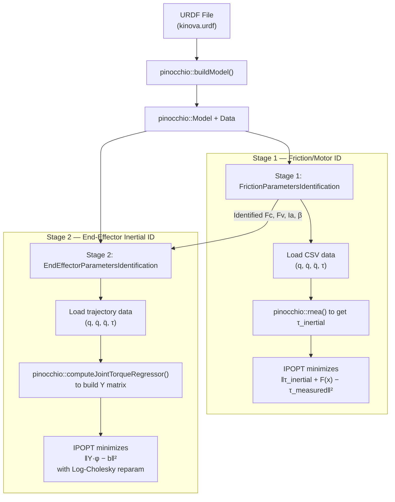
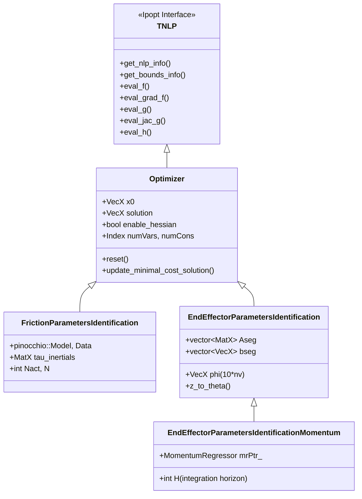

# RAPTOR C++ System Identification Pipeline — Full Walkthrough

> [!IMPORTANT]
> **User Preferences (always respect these):**
> - The user writes or copy-pastes ALL code themselves. Do **NOT** automatically write, edit, or run code files.
> - Act as a thinking partner and explainer. Generate code in the chatbox for copy-pasting only.
> - Building markdown artifacts is fine. Modifying `.cpp`, `.h`, `.py`, `.m`, or any source files directly is **not**.
> - Do not run terminal commands that execute or modify code without explicit user permission.

## 0. Full Pipeline Execution Flow (How to Actually Run System ID)

> [!NOTE]
> Friction ID is done once during robot commissioning. EE Inertial ID is re-done each time a new payload is attached (quick calibration before a task).

```
Step 0 (one-time): Design exciting (exciting here means which keeps the regressor matrix conditioning number as less as possible, friction sinusoidal is not exciting in that sense, since no regressor matrix there) trajectory
    → C++: KinovaRegressorExample      (outputs exciting-trajectory.csv)
    → For Go1: need to adapt or skip (use sinusoidal directly?)

Step 1: Collect trajectory data
    → Simulation: 
        - For friction, its sysid_friction_trajectory_generator.py (Python, pinocchio sim)
        - For inertia, TODO: Need to generate exciting trajectories, previously was done using ARMOUR for Kinove to satisfy safety constraints, joint limits, and minimizing conditioning number. I do not care for safety constraints here. Need to find code, to see how this is generated. 
    → Hardware:   play exciting trajectory on robot, record LowState at 500 Hz
    → Filter + downsample → q, q_d, q_dd, tau CSVs ("q_downsampled_N.csv" etc.)

Step 2: Run Friction ID  [OFFLINE, C++ binary]
    → C++:   TestFrictionParametersIdentification <N>
    → Input:  q_downsampled_N.csv, q_d_downsampled_N.csv,
              q_dd_downsampled_N.csv, tau_downsampled_N.csv
    → Output: friction_parameters_solution_N.csv
              [Fc_1..Fc_n, Fv_1..Fv_n, Ia_1..Ia_n]
        
Step 3: Run Inertial ID  [C++ binary OR Python wrapper]
    → C++:    TestEndEffectorParametersIdentification (synthetic data only, for testing)
    → C++:    TestEndEffectorParametersIdentificationMomentum (hardware .txt files)
    → Python: test_sysid_inverse_dynamics.py via end_effector_sysid_nanobind wrapper (Optional, can do directlty the C++ files)
    → Input:  traj_data.csv + acceleration_filtered.csv + friction_params.csv
    → Output: end-effector inertial parameters [m, hx, hy, hz, Ixx...Izz]
```


> [!IMPORTANT]
> `TestEndEffectorParametersIdentification` does NOT load from CSV files — it generates **synthetic trajectory data internally** using `BezierCurves` ([L25-46](file:///Users/akshunn/ROAHM%20Lab/RAPTOR/Examples/Unitree-Go1/SystemIdentification/ParametersIdentification/TestEndEffectorParametersIdentification.cpp#L25-L46)). It is a **unit test / validation file** only. The real hardware data loading happens in `TestEndEffectorParametersIdentificationMomentum` via `.txt` hardware trajectory files.

### Hardware Inertial ID: CSV vs TXT Clarification

The exciting trajectory CSV and hardware `.txt` file serve **different roles**:

| File | Origin | What it is |
|---|---|---|
| `exciting-trajectory.csv` | `KinovaRegressorExample` output | **COMMAND**: designed trajectory `[time, q_desired, q_d_desired, tau_feedforward]`. Sent to robot controller. |
| `2024_11_17_no_gripper_id_N.txt` | Real robot hardware logger | **MEASUREMENT**: what robot actually did `[time, q_actual, q_d_actual, tau_actual]`. Logged by Kinova SDK during execution. |

The hardware inertial ID workflow is:
```
1. Run KinovaRegressorExample → exciting-trajectory.csv   (designed command)
2. Upload CSV to robot controller → robot executes trajectory with payload attached
3. Hardware logger records actual states → saves as .txt                (measured data)
4. TestEndEffectorParametersIdentificationMomentum reads .txt → identifies φ_EE
```

The code at [L40-42](file:///Users/akshunn/ROAHM%20Lab/RAPTOR/Examples/Unitree-Go1/SystemIdentification/ParametersIdentification/TestEndEffectorParametersIdentificationMomentum.cpp#L40-L42) shows the CSV option is commented out — it was used for simulation/debugging only. Measured `.txt` data is preferred because it contains real friction, noise, and tracking errors that improve identification accuracy.

---

## 1. Big Picture: Two Pipelines, Two Projects

You're looking at **two separate sys ID codebases** that solve the same fundamental problem — identifying a robot's dynamic parameters from trajectory data — but for different robots and with different design philosophies:

| Aspect | **RAPTOR** (C++) | **ConstrainedSysID** (MATLAB) |
|---|---|---|
| Robot | Kinova Gen3 manipulator | Digit humanoid / Go1 leg |
| Robot model | Auto-generated from **URDF via Pinocchio** | **Hand-built** in `Go1Leg_model.m` using `spatial_v2` |
| Regressor | `pinocchio::computeJointTorqueRegressor()` | `RegressorClassical.m` (RNEA-based, by hand) |
| Optimizer | **IPOPT** (C++ NLP solver) | **fmincon** (MATLAB SQP) |
| Constraints | Baked into reparameterization (unconstrained NLP) | Explicit LMI + bounds in fmincon |
| Two-stage? | **Yes**: Friction ID → EE Inertial ID | **Combined**: identifies all params jointly (`SearchAll=true`) |

> [!IMPORTANT]
> The C++ RAPTOR pipeline splits the identification into **two sequential optimizations**. MATLAB ConstrainedSysID typically does it **in one shot** (`SysIDAlgFull`). This is the biggest structural difference.

---

## 2. RAPTOR Pipeline Architecture



---

## 3. Stage 1: Friction Parameters Identification

### What it identifies
The motor-side parameters: `Fc` (Coulomb friction), `Fv` (viscous damping), `Ia` (armature/rotor inertia), and optionally `β` (offset/bias).

### MATLAB equivalent
In ConstrainedSysID, these are `X_fm = [Im_1, Im_2, Im_3, Fc_1, Fv_1, Fc_2, Fv_2, Fc_3, Fv_3]` in [SysIDMain.m:L83-88](file:///Users/akshunn/ROAHM%20Lab/system_id/ConstrainedSysID/SysIDMain.m#L83-L88).

> **MATLAB equivalent**: `SysIDData.m` calls `dataProcessing()` which filters and resamples the raw data, then stores it as rows of `[q; qdot; qddot; torq]`. The C++ version expects pre-processed CSV files — the filtering happens offline.

**Step 2: Compute inertial torque** ([FrictionParametersIdentification.cpp:L44-54](file:///Users/akshunn/ROAHM%20Lab/RAPTOR/Examples/Kinova/SystemIdentification/ParametersIdentification/src/FrictionParametersIdentification.cpp#L44-L54))
```cpp
// For each timestep, compute τ_inertial = RNEA(q, q̇, q̈) using Pinocchio
pinocchio::rnea(*modelPtr_, *dataPtr_, q, v, a);
tau_inertials.col(i) = dataPtr_->tau;
// tau_inertials is MatX (nv × N): columns = timesteps, rows = joints
```

> **MATLAB equivalent**: In the MATLAB pipeline, `RegressorClassical.m` computes the full regressor `W_ip * phi` which includes inertial torques. The C++ version uses Pinocchio's RNEA directly — **this is the key advantage**: you don't need to hand-derive RNEA for each robot.

**Step 3: Objective function** ([FrictionParametersIdentification.cpp:L140-182](file:///Users/akshunn/ROAHM%20Lab/RAPTOR/Examples/Kinova/SystemIdentification/ParametersIdentification/src/FrictionParametersIdentification.cpp#L140-L182))

The friction model is: `τ = τ_inertial + Fc·sign(q̇) + Fv·q̇ + Ia·q̈ + β`

```cpp
// Decision variable z is laid out as: [Fc_1..Fc_n | Fv_1..Fv_n | Ia_1..Ia_n | (β_1..β_n)]
VecX friction = z.head(Nact);           // Fc: static/Coulomb friction
VecX damping  = z.segment(Nact, Nact);  // Fv: viscous damping
VecX armature = z.segment(2*Nact, Nact);// Ia: armature/rotor inertia
// Objective: min Σ_i ½‖τ_estimated(i) − τ_measured(i)‖²
```

> **MATLAB equivalent**: Same math in `SysIDAlgFull.m`, but combined with inertial params. In MATLAB, the decision variable packs `[X_ip; X_fm]` as one vector — inertial params first, then friction/motor. C++ separates them into two distinct optimization problems.

### Key data types

| C++ Type | What it is | Size |
|---|---|---|
| `pinocchio::Model` | Robot kinematic/dynamic model parsed from URDF | (opaque) |
| `pinocchio::Data` | Workspace for algorithms (like RNEA) | (opaque) |
| `MatX` = `Eigen::MatrixXd` | Dynamic-size double matrix | varies |
| `VecX` = `Eigen::VectorXd` | Dynamic-size double vector | varies |
| `std::shared_ptr<MatX>` | Shared ownership pointer to a matrix | (pointer) |
| `Index` | Ipopt's integer type (`int`) | 4 bytes |
| `Number` | Ipopt's scalar type (`double`) | 8 bytes |

### NLP structure (No bias if I am correct)
- **Decision variables**: `3*Nact` (or `4*Nact` with offset) — per joint: `[Fc, Fv, Ia, (β)]`
- **Constraints**: `m = 0` (none!)
- **Variable bounds**: `Fc ∈ [0,50]`, `Fv ∈ [0,50]`, `Ia ∈ [0,50]`, `β ∈ [-50,50]`
- **Objective**: quadratic least-squares → **exact Hessian is provided** (constant w.r.t. x!)

> **MATLAB equivalent**: In MATLAB's fmincon, these would be `lb_fm` and `ub_fm` in [SysIDMain.m:L110-121](file:///Users/akshunn/ROAHM%20Lab/system_id/ConstrainedSysID/SysIDMain.m#L110-L121).

---

## 4. Stage 2: End-Effector Inertial Parameters Identification

### What it identifies
The 10 dynamic parameters of the **last link** (end-effector/payload): `[m, hx, hy, hz, Ixx, Ixy, Iyy, Ixz, Iyz, Izz]`.

### Why only the last link?
The assumption is that the rest of the robot's inertial parameters are **already known** (from the URDF or a prior whole-body identification). Only the end-effector is unknown — e.g., a new gripper or payload was attached.

### MATLAB equivalent
In ConstrainedSysID with `SearchAll=true`, inertial params for ALL links are identified simultaneously (`X0_ip` in [SysIDMain.m:L64-74](file:///Users/akshunn/ROAHM%20Lab/system_id/ConstrainedSysID/SysIDMain.m#L64-L74)). The C++ version is **more targeted** — it only touches the last link.

### Key files

| C++ File | Role |
|---|---|
| [TestEndEffectorParametersIdentification.cpp](file:///Users/akshunn/ROAHM%20Lab/RAPTOR/Examples/Kinova/SystemIdentification/ParametersIdentification/TestEndEffectorParametersIdentification.cpp) | **Driver** (synthetic data test) |
| [EndEffectorParametersIdentification.h](file:///Users/akshunn/ROAHM%20Lab/RAPTOR/Examples/Kinova/SystemIdentification/ParametersIdentification/include/EndEffectorParametersIdentification.h) | Class declaration |
| [EndEffectorParametersIdentification.cpp](file:///Users/akshunn/ROAHM%20Lab/RAPTOR/Examples/Kinova/SystemIdentification/ParametersIdentification/src/EndEffectorParametersIdentification.cpp) | NLP callbacks + Log-Cholesky parameterization |

### Data flow walkthrough

**Step 1: Extract inertial parameters from URDF** ([EndEffectorParametersIdentification.cpp:L23-28](file:///Users/akshunn/ROAHM%20Lab/RAPTOR/Examples/Kinova/SystemIdentification/ParametersIdentification/src/EndEffectorParametersIdentification.cpp#L23-L28))
```cpp
// phi is a 10*nv vector: 10 dynamic params per joint
phi = VecX::Zero(10 * modelPtr_->nv);
for (Index i = 0; i < modelPtr_->nv; i++) {
    const int pinocchio_joint_id = i + 1;
    // toDynamicParameters() returns [m, hx, hy, hz, Ixx, Ixy, Iyy, Ixz, Iyz, Izz]
    phi.segment<10>(10 * i) = 
        modelPtr_->inertias[pinocchio_joint_id].toDynamicParameters();
}
```

> **MATLAB equivalent**: `X0_ip` in `SysIDMain.m` — manually entered from URDF values. The C++ version reads them **automatically** from Pinocchio.

**Step 2: Build the regressor matrix** ([EndEffectorParametersIdentification.cpp:L117-146](file:///Users/akshunn/ROAHM%20Lab/RAPTOR/Examples/Kinova/SystemIdentification/ParametersIdentification/src/EndEffectorParametersIdentification.cpp#L117-L146))
```cpp
// For each timestep: compute the joint torque regressor Y such that τ = Y * φ
pinocchio::computeJointTorqueRegressor(*modelPtr_, *dataPtr_, q, q_d, q_dd);
// dataPtr_->jointTorqueRegressor is nv × 10*nv

// Stack into A_seg_i (N*nv × 10*nv) and b_seg_i (N*nv)
A_seg_i.middleRows(i * modelPtr_->nv, modelPtr_->nv) = dataPtr_->jointTorqueRegressor;
b_seg_i.segment(i * modelPtr_->nv, modelPtr_->nv) = 
    tau - friction_terms - damping_terms - armature_terms - offset;
```

> [!NOTE]
> **Confusing naming convention**: In the `TrajectoryData` class, `q_dd(i)` actually stores **measured torque** (not acceleration!). The actual acceleration is in a separate `acceleration` matrix. The comment in the code warns about this.

> **MATLAB equivalent**: `RegressorClassical.m` + `W_ip` in `SysIDGo1.m`. The MATLAB version builds the regressor `W_ip` by hand using spatial algebra (`individualRegressor.m`, `jcalc.m`, etc.). The C++ version calls `pinocchio::computeJointTorqueRegressor()` — same math, but Pinocchio does it for you.

**Step 3: The Log-Cholesky parameterization** ([EndEffectorParametersIdentification.cpp — z_to_theta](file:///Users/akshunn/ROAHM%20Lab/RAPTOR/Examples/Kinova/SystemIdentification/ParametersIdentification/src/EndEffectorParametersIdentification.cpp#L272-L305))

This is the **most important difference** from the MATLAB approach. Instead of adding LMI constraints to ensure physical consistency (positive mass, positive-definite inertia tensor), the C++ version uses a **change of variables** that makes **any** value of `z ∈ ℝ¹⁰` produce a physically valid set of parameters:

```
z = [α, d₁, d₂, d₃, s₁₂, s₂₃, s₁₃, t₁, t₂, t₃]  ← 10 unconstrained optimization variables

θ = z_to_theta(z)  → 10 physically-consistent dynamic parameters
```

The mapping constructs a pseudo-inertia matrix that is **positive semi-definite by construction**:
- Mass: `m = exp(2α)` → always > 0
- First moments: `h = exp(2α) · [t₁, t₂, t₃]` → unrestricted (CoM can be anywhere)
- Inertia tensor diagonal: uses `exp(d_i)²` terms → always > 0
- Inertia tensor off-diagonal: built from `s_ij` and `t_i` cross-terms

> [!TIP]
> This is from the paper by **Rucker & Wensing (2022)**, "Smooth Parameterization of Rigid-Body Inertia" (IEEE RA-L). The key insight: instead of constrained optimization, reparameterize so the feasible set is all of ℝⁿ.

> **MATLAB equivalent**: ConstrainedSysID uses **explicit LMI constraints** in `fmincon` to enforce physical consistency (`includeConstraints = true`, `constraintVariant`). The C++ approach is mathematically cleaner but harder to extend to all links simultaneously.

**Step 4: Objective function** ([EndEffectorParametersIdentification.cpp — eval_f](file:///Users/akshunn/ROAHM%20Lab/RAPTOR/Examples/Kinova/SystemIdentification/ParametersIdentification/src/EndEffectorParametersIdentification.cpp#L184-L204))
```cpp
// Only the LAST 10 entries of phi are optimized (end-effector)
phi.tail(10) = z_to_theta(z);  // For entire leg sysid, I can change this from last 10 to entire leg inertial paramaeters. 
// Objective: Σ_segments ½‖A * φ − b‖²
for (Index i = 0; i < Aseg.size(); i++) {
    const VecX diff = Aseg[i] * phi - bseg[i];
    obj_value += 0.5 * diff.dot(diff);
}
```

### NLP structure
- **Decision variables**: 10 (the `z` vector for the end-effector)
- **Constraints**: `m = 0` (none! feasibility is via reparameterization)
- **No variable bounds** (all of ℝ¹⁰ is feasible)
- **Exact Hessian provided** via `dd_z_to_theta` — Gauss-Newton + second-order correction terms

---

## 5. Stage 2b: Momentum-Based End-Effector ID (Alternative, and Prefereable)

[EndEffectorParametersIdentificationMomentum](file:///Users/akshunn/ROAHM%20Lab/RAPTOR/Examples/Kinova/SystemIdentification/ParametersIdentification/include/EndEffectorParametersIdentificationMomentum.h) is a subclass of `EndEffectorParametersIdentification` that uses **momentum dynamics** instead of inverse dynamics:

```
H(q)·q̇ = Y_momentum · φ     (momentum = regressor × params)
```

**Key advantage**: No need to estimate joint accelerations `q̈`, which are very noisy in practice. Instead, it integrates the dynamics:

```
∫(τ - C^T·q̇) dt = H(q)·q̇ - H(q₀)·q̇₀
```

This uses the regressor classes in [KinematicsDynamics/](file:///Users/akshunn/ROAHM%20Lab/RAPTOR/KinematicsDynamics/):

| C++ Class | Role | MATLAB equivalent |
|---|---|---|
| [RegressorInverseDynamics](file:///Users/akshunn/ROAHM%20Lab/RAPTOR/KinematicsDynamics/include/RegressorInverseDynamics.h) | Computes `τ = Y·φ` with analytical gradient `∂Y/∂z` | `RegressorClassical.m` |
| [MomentumRegressor](file:///Users/akshunn/ROAHM%20Lab/RAPTOR/KinematicsDynamics/include/MomentumRegressor.h) | Computes `H·q̇ = Y·φ` and `C^T·q̇ = Y_CTv·φ` | (no direct equivalent in ConstrainedSysID) |
| [IntervalMomentumRegressor](file:///Users/akshunn/ROAHM%20Lab/RAPTOR/KinematicsDynamics/include/IntervalMomentumRegressor.h) | Interval arithmetic version for robustness | (no equivalent) |

---

## 6. Go1 Friction Parameter Identification — Implementation Plan

### 6.1 Overview

**Goal**: Simulate a single Go1 leg, generate trajectory data with known friction, run the C++ friction ID solver to recover friction parameters, then validate that the identified parameters improve control tracking.

**Robot structure**: Go1 has 4 identical legs × 3 joints each = 12 actuated joints. We focus on **one leg** (e.g., FR = Front Right):

| Joint Index | Name | Axis | Range (rad) | Torque limit (N·m) |
|---|---|---|---|---|
| 0 | `1_FR_hip_joint` | Roll (x) | [-0.863, 0.863] | 23.7 |
| 1 | `1_FR_thigh_joint` | Pitch (y) | [-0.686, 4.501] | 23.7 |
| 2 | `1_FR_calf_joint` | Pitch (y) | [-2.818, -0.888] | 35.55 |


> 1. ✅ **[CHOSEN] Use the full model** but only excite 3 joints (freeze others at nominal) — simpler to implement but CSVs have 12 columns.
>
> **Decision**: Use option 1 (full model, freeze 9 joints). The C++ `TestFrictionParametersIdentification` doesn't care about which joints moved — it fits friction per-joint. Joints that don't move will have near-zero identified friction (which is fine since they didn't contribute data).

### 6.2 Phase 1 — Data Generation (Python Simulation)

**Script**: `test_friction_sysid_go1.py` (new file in `Examples/Unitree-Go1/python/`)

**Architecture**: Replicate `test_sysid_inverse_dynamics.py` structure with these key modifications:

#### 6.2.1 Trajectory Design

Multi-frequency sinusoidal per joint to excite different friction regimes:

```python
# Design within joint limits. q_center is the midpoint of the range.
# Amplitude must ensure q_center ± A stays within [q_lower, q_upper] with margin.

# FR hip:   center = 0.0,    safe amplitude = 0.7  (limits ±0.863)
# FR thigh: center = 1.9,    safe amplitude = 1.5  (limits [-0.686, 4.501])
# FR calf:  center = -1.85,  safe amplitude = 0.8  (limits [-2.818, -0.888])
```

Use different frequencies per joint to maximize excitation:

```python
def desired_trajectory_friction(t, joint_idx):
    """Generate exciting trajectory for a single joint."""
    centers = [0.0, 1.9, -1.85]
    amplitudes = [0.7, 1.5, 0.8]
    
    c = centers[joint_idx]
    A = amplitudes[joint_idx]
    
    # Multi-freq: low (Fc excitation) + mid (Fv) + high (Ia)
    qd    = c + A * (0.5*sin(0.5*t) + 0.3*sin(2.0*t) + 0.1*sin(7.0*t))
    qd_d  = A * (0.5*0.5*cos(0.5*t) + 0.3*2.0*cos(2.0*t) + 0.1*7.0*cos(7.0*t))
    qd_dd = A * (-0.5*0.25*sin(0.5*t) - 0.3*4.0*sin(2.0*t) - 0.1*49.0*sin(7.0*t))
    return qd, qd_d, qd_dd
```

#### 6.2.2 Freezing Joints (The Core Technique)

**How to make only one joint move while others stay fixed:**

For the **full 12-DOF model**, set the desired trajectory to a constant (nominal) value for all 11 non-target joints. The PD controller will hold them in place:

```python
def desired_trajectory_full(t, active_joint_idx):
    """
    Returns desired (q, qd, qdd) for ALL 12 joints.
    Only active_joint_idx gets a sinusoidal trajectory.
    All others get a constant hold position.
    """
    nv = 12  # full Go1 model
    qd    = np.array(q_nominal)  # all joints at nominal stand pose
    qd_d  = np.zeros(nv)
    qd_dd = np.zeros(nv)
    
    # Only the active joint gets the exciting trajectory
    qd[active_joint_idx], qd_d[active_joint_idx], qd_dd[active_joint_idx] = \
        desired_trajectory_friction(t, active_joint_idx % 3)
    
    return qd, qd_d, qd_dd
```

**PD gains for frozen joints should be HIGH** (stiff hold), active joint PD gains should be moderate (allows some tracking error, which is fine for data generation):

```python
def controller(q, v, qd, qd_d, qd_dd, active_joint_idx):
    kp = np.ones(nv) * 500.0   # high stiffness for frozen joints
    kd = np.ones(nv) * 50.0
    
    kp[active_joint_idx] = 200.0  # moderate for active joint
    kd[active_joint_idx] = 20.0
    
    tau = kp * (qd - q) + kd * (qd_d - v)
    return tau
```

#### 6.2.3 Forward Simulation with Friction

**Critical**: `pin.aba()` does NOT model friction. You must add it manually in the dynamics:

```python
def dynamics_with_friction(t, state, model, data, Fc_true, Fv_true, Ia_true):
    q = state[:nv]
    v = state[nv:]
    
    qd, qd_d, qd_dd = desired_trajectory_full(t, active_joint)
    tau_cmd = controller(q, v, qd, qd_d, qd_dd, active_joint)
    
    # Coulomb + viscous friction resist motion — subtract from commanded torque
    tau_friction = Fc_true * np.sign(v) + Fv_true * v
    tau_net = tau_cmd - tau_friction
    
    # ✅ [CHOSEN] Armature: set on model BEFORE calling ABA.
    # Pinocchio adds diag(Ia) to the joint-space inertia matrix natively.
    # Do NOT manually subtract Ia*a — that is physically wrong.
    model.armature = Ia_true
    
    a = pin.aba(model, data, q, v, tau_net)
    
    return np.concatenate([v, a])
```

> [!IMPORTANT]
> **Armature inertia**: Pinocchio's `pin.aba()` **does** support `model.armature` natively! If you set `model.armature = Ia_true` before calling ABA, it automatically adds rotor inertia to the effective mass matrix. So you don't need to subtract `Ia * q̈` manually — just set the field. Only `Fc` and `Fv` need manual handling.

> [!IMPORTANT]
> **What torque to record**: Save `tau_cmd` (the motor command), **NOT** `tau_net`. On real hardware, the torque sensor reads the motor current → that is `tau_cmd`. The C++ friction ID solver does: `residual = tau_cmd - RNEA(q, v, a) - friction_model(v, a)`, and RNEA internally accounts for armature if set in the model. So the data pipeline expects the raw motor output.

> [!NOTE]
> **Hardware footnote — β (offset) parameter**: The full friction model has 4 terms per joint: `τ_friction = Fc·sign(q̇) + Fv·q̇ + Ia·q̈ + β`. In simulation, β = 0 (no sensor bias). On real hardware, β absorbs:
> - Torque sensor bias (reads non-zero at zero torque)
> - Asymmetric Coulomb friction (+ vs − direction not equal)
> - Residual gravity compensation error
> [!IMPORTANT]
> **To enable β identification on hardware**: set `include_offset_input = true` in `TestFrictionParametersIdentification.cpp` (L26). The decision variable grows from `3*Nact` to `4*Nact` (for Go1 full model: 36 → 48 variables). The output CSV will then contain `[Fc(12), Fv(12), Ia(12), β(12)]`. Do this only on real hardware — in simulation β = 0 always and identifying it adds unnecessary complexity. 

#### 6.2.4 Acceleration & Filtering

**Low-pass filter in simulation?** Not strictly needed (simulation is noise-free), but **recommended** for realism and to match the hardware pipeline:

```python
# Compute acceleration via central difference on velocity
accs, dt_acc = central_difference_4th_order(ts_sim, vs)

# Optional: filter if you want to mimic hardware workflow
# accs_filtered = butterworth_lowpass_filter(accs, cutoff=30, fs=1/dt)
accs_filtered = accs  # skip in sim
```

#### 6.2.5 Output Files

Save in the format `TestFrictionParametersIdentification` expects. Each CSV: `(N_timesteps × nv)` where `nv = 12` for full model:

```python
output_dir = "../Examples/Unitree-Go1/SystemIdentification/ParametersIdentification/friction_data/"
np.savetxt(output_dir + "q_downsampled_1.csv",    qs_ds,   delimiter=" ")
np.savetxt(output_dir + "q_d_downsampled_1.csv",  vs_ds,   delimiter=" ")
np.savetxt(output_dir + "q_dd_downsampled_1.csv", accs_ds, delimiter=" ")
np.savetxt(output_dir + "tau_downsampled_1.csv",   taus_ds, delimiter=" ")
```

### 6.3 Phase 2 — Friction ID (C++ Solver)

> [!IMPORTANT]
> **Phase 2 is the next step.** Phase 1 (Python simulation + CSV generation) is ✅ COMPLETE.
> The CSVs are on disk. The C++ solver just needs to be built and run.

#### What the C++ solver does

Reads the 4 CSVs → runs IPOPT optimization → outputs `friction_parameters_solution_1.csv` containing `[Fc(12), Fv(12), Ia(12)]`.

The identified friction for the 11 frozen joints will be near-zero (they didn't move). The 1 active joint (e.g. j1 = FR Thigh) will have meaningful values close to `Fc_true, Fv_true, Ia_true` that were injected in simulation.

---

## 7. Inertial SysID Plan

Approach 1: Use Examples/Unitree_Go1/SystemIdentification/ExcitingTrajectories/KinovaRegressorExamplePayload.cpp as a template to build end effector trajectory generator for Go1 without 
obstacles. You should be able to use the existing pipeline to get the calf inertial parameters then.
Update: Ran the exciting trajectory generation, with all 12 joints excited, [TODO] need to excite only one joint. 

Approach 2: Use the Examples/Unitree_Go1/SystemIdentification/ExcitingTrajectories/KinovaRegressorExample.cpp as a template to build entire leg/entire body trajectory generator for Go1 and figure out 
a way to modify the end effector parameter estimation pipeline to work this out. 
Update: Ran the exciting trajectory generation, with all 12 joints excited. [TODO] excite only one leg completely. and pull the last 10 inertial parameters to include all 3 joints of a leg, optimize and get results. Keep other joints like free (like no torque so I can bing them or something) . Just treat each leg as a seperate robot arm and do sysID. Can just force all inactive legs to be forced to be at nominal positions so it can lay back in prone position. Otherwise will need to find a way in model to get only required joint terms in simulation. 
1) Prone positions [TODO: Find nominal positions for prone position for Go1 to keep other legs still]
2) Generate and viz the trajectory for sanity.
Optimization: 
1) Optimize for all inertial params simultaneously. Lets see. should just need to change params to [:10] to [:-all inertial params in the body]


## 8. The Optimizer Base Class (IPOPT Interface)

All sys ID classes inherit from [Optimizer](file:///Users/akshunn/ROAHM%20Lab/RAPTOR/Optimization/include/Optimizer.h), which inherits from `Ipopt::TNLP`. This is the C++ interface to IPOPT.



The key methods each subclass **must** implement:

| IPOPT Method | What it does | MATLAB equivalent |
|---|---|---|
| `get_nlp_info()` | Returns # variables, # constraints | Problem dimensions in fmincon call |
| `get_bounds_info()` | Returns `lb`, `ub` for vars and constraints | `lb`, `ub` in `SysIDMain.m` |
| `eval_f()` | Computes objective value `f(x)` | Objective function handle in fmincon |
| `eval_grad_f()` | Computes gradient `∇f(x)` | `SpecifyObjectiveGradient` in fmincon |
| `eval_g()` | Computes constraint values `g(x)` | Constraint function handle |
| `eval_jac_g()` | Computes constraint Jacobian | `SpecifyConstraintGradient` in fmincon |
| `eval_h()` | Computes Hessian of Lagrangian | (fmincon uses BFGS by default) |

> [!TIP]
> The `Optimizer` base class provides default implementations for `eval_g`, `eval_jac_g`, `eval_h` that **delegate to subclass methods** `eval_f`, `eval_grad_f`, `eval_hess_f` and assemble the full Lagrangian Hessian. So the subclasses only need to provide objective-related callbacks.

---

## 9. Where's the "Missing" Code?

You noticed that the C++ pipeline doesn't have a single monolithic "run everything" file like `SysIDMain.m`. Here's where each piece lives:

| MATLAB step | MATLAB file | C++ equivalent |
|---|---|---|
| Build robot model | `Go1Leg_model.m` | `pinocchio::urdf::buildModel(urdf_filename)` — **automatic from URDF** |
| Build regressor | `RegressorClassical.m` + `regressor/*.m` | `pinocchio::computeJointTorqueRegressor()` or `RegressorInverseDynamics` class |
| Data loading & filtering | `SysIDData.m` + `dataProcessing.m` | CSV loading via `Utils::initializeEigenMatrixFromFile()` — **filtering done offline** |
| QR regrouping | `QRDecomposition.m` | **Not implemented** — RAPTOR uses a different approach (Log-Cholesky instead) |
| Optimization | `SysIDAlgFull.m` via `fmincon` | `Optimizer` subclass + IPOPT via `app->OptimizeTNLP(mynlp)` |
| Physical consistency | LMI constraints in fmincon | `z_to_theta()` reparameterization |
| Exciting trajectory design | (not in ConstrainedSysID) | [ExcitingTrajectories/](file:///Users/akshunn/ROAHM%20Lab/RAPTOR/Examples/Kinova/SystemIdentification/ExcitingTrajectories/) — **bonus in C++** |


---


### 9.1 Phase 2: Build & Run C++ Solver

**Inside the container — build:**
```bash
cd /workspaces/RAPTOR
mkdir build && cd build
cmake ..
make Go1_SysidFriction_test -j4    # only builds the one target, much faster
```

**Inside the container — run:**
```bash
# Must run from build/ because CSV paths in .cpp use "../Examples/..." relative to build/
cd /workspaces/RAPTOR/build
./Go1_SysidFriction_test 1         # "1" = reads *_1.csv files (joint 1 = FR Thigh)
```

**Expected output:**
```
Total solve time: ~50 milliseconds
parameter solution: [Fc_0 .. Fc_11  Fv_0 .. Fv_11  Ia_0 .. Ia_11]
```

**Output files written to:**
```
Examples/Unitree_Go1/SystemIdentification/ParametersIdentification/full_params_data/
    friction_parameters_solution_1.csv    ← 36 values: [Fc(12), Fv(12), Ia(12)]
    friction_estimate_tau_1.csv           ← reconstructed torque (for validation plot)
```

**To run for each joint:**
```bash
./Go1_SysidFriction_test 0    # FR Hip
./Go1_SysidFriction_test 1    # FR Thigh
./Go1_SysidFriction_test 2    # FR Calf
```

#### Sanity check after running
Open `friction_parameters_solution_1.csv`. The values are laid out as:
```
[Fc_j0, Fc_j1, ..., Fc_j11,   ← first 12 rows: Coulomb friction per joint
 Fv_j0, Fv_j1, ..., Fv_j11,   ← next 12 rows: viscous damping per joint
 Ia_j0, Ia_j1, ..., Ia_j11]   ← last 12 rows: armature inertia per joint
```

For `active_joint = 1`, expect:
- `Fc_j1 ≈ 0.8`, `Fv_j1 ≈ 0.5`, `Ia_j1 ≈ 0.03` (matching `Fc_true[1], Fv_true[1], Ia_true[1]`)
- All other joints' values ≈ 0 (they were frozen)

---

### 9.4 Phase 3 — Validation via IDC Tracking Comparison (PENDING)

**Goal**: Show that identified friction parameters improve control performance.

#### 9.4.1 Why IDC for Validation (Not PD)

Simple PD: `τ = Kp·e + Kd·ė` → tracking quality depends on **gains**, not model quality. A lucky gain choice can mask bad parameters.

IDC (Inverse Dynamics Control / Computed Torque):
```
τ = M̂(q)·(q̈_d + Kd·ė + Kp·e) + Ĉ(q,q̇)·q̇ + ĝ(q) + F̂c·sign(q̇) + F̂v·q̇
         └─── PD on error ────┘    └──── model-based cancellation ──────────┘
```

If `M̂, Ĉ, ĝ, F̂c, F̂v` are perfect → tracking error converges to zero (linear dynamics).
If `M̂, Ĉ, ĝ, F̂c, F̂v` are wrong → residual nonlinear dynamics → tracking error grows.

**This directly exposes model quality.** The controller performance becomes a proxy for parameter accuracy.

#### 9.4.2 Two Scenarios to Compare

Simulate tracking a **NEW** sinusoidal trajectory (different frequencies from the one used for identification!) under two parameter sets:

```
Scenario A: IDC with true friction parameters (Fc_true, Fv_true, Ia_true)
            → best possible tracking (perfect model)

Scenario B: IDC with identified friction parameters from Phase 2 (Fc_estimated, Fv_estimated, Ia_estimated)
            → should be close to A if the optimizer recovered good parameters
```

The "ground truth simulator" always uses the true parameters — the true model generates the actual robot states. The IDC controller uses whichever parameter set is being tested.


#### 9.4.3 IDC Implementation

```python
def idc_controller(q, v, qd, qd_d, qd_dd, model_hat, data_hat, Fc_hat, Fv_hat):
    """Inverse dynamics control using estimated model parameters."""
    e = qd - q
    e_d = qd_d - v
    a_desired = qd_dd + Kd * e_d + Kp * e   # desired acceleration
    
    # Compute model-based feedforward using ESTIMATED model
    tau_ff = pin.rnea(model_hat, data_hat, q, v, a_desired)
    
    # Add friction compensation using ESTIMATED friction
    tau_friction_comp = Fc_hat * np.sign(v) + Fv_hat * v
    
    return tau_ff + tau_friction_comp
```

#### 9.4.4 Validation Metrics

```python
# For each scenario, compute:
tracking_error = np.linalg.norm(q_actual - q_desired, axis=1)  # per timestep
rmse = np.sqrt(np.mean(tracking_error**2))
max_error = np.max(tracking_error)
```

Expected results:
```
RMSE(A) ≈ 0.001  (near-perfect, limited by Kp/Kd)
RMSE(B) ≈ RMSE(A)  (identified params ≈ true params → good tracking)
```

If `RMSE(B) >> RMSE(A)`, the identification failed — go back and check data quality.

#### 9.4.5 Phase 4 — Sequential Per-Joint Identification

Run the entire pipeline 3 times for one leg:

```
Run 1: active_joint = 2 (FR_calf)   → identify Fc_calf, Fv_calf, Ia_calf
Run 2: active_joint = 1 (FR_thigh)  → identify Fc_thigh, Fv_thigh, Ia_thigh
Run 3: active_joint = 0 (FR_hip)    → identify Fc_hip, Fv_hip, Ia_hip
```

Each run generates its own CSVs and solves independently. Combine the 3 results at the end.

> [!NOTE]
> **Order doesn't matter for friction ID** (unlike inertial ID where distal-first matters). Each joint's friction is entirely local: `Fc_i · sign(q̇_i)` only depends on joint i's own velocity. No cross-joint coupling.


#### 9.4.5 Phase 3 — Validation via IDC Tracking Comparison

**Goal**: Show that identified friction parameters improve control performance.

#### 9.4.5.1 Why IDC for Validation (Not PD)

Simple PD: `τ = Kp·e + Kd·ė` → tracking quality depends on **gains**, not model quality. A lucky gain choice can mask bad parameters.

IDC (Inverse Dynamics Control / Computed Torque):
```
τ = M̂(q)·(q̈_d + Kd·ė + Kp·e) + Ĉ(q,q̇)·q̇ + ĝ(q) + F̂c·sign(q̇) + F̂v·q̇
         └─── PD on error ────┘    └──── model-based cancellation ──────────┘
```

If `M̂, Ĉ, ĝ, F̂c, F̂v` are perfect → tracking error converges to zero (linear dynamics).
If `M̂, Ĉ, ĝ, F̂c, F̂v` are wrong → residual nonlinear dynamics → tracking error grows.

**This directly exposes model quality.** The controller performance becomes a proxy for parameter accuracy.

#### 10.4.2 Two Scenarios to Compare

Simulate tracking a **NEW** sinusoidal trajectory (different frequencies from the one used for identification!) under two parameter sets:

```
Scenario A: IDC with true friction parameters (Fc_true, Fv_true, Ia_true)
            → best possible tracking (perfect model)

Scenario B: IDC with identified friction parameters from Phase 2 (Fc_estimated, Fv_estimated, Ia_estimated)
            → should be close to A if the optimizer recovered good parameters
```

The "ground truth simulator" always uses the true parameters — the true model generates the actual robot states. The IDC controller uses whichever parameter set is being tested.

#### 9.4.5.3 IDC Implementation

```python
def idc_controller(q, v, qd, qd_d, qd_dd, model_hat, data_hat, Fc_hat, Fv_hat):
    """Inverse dynamics control using estimated model parameters."""
    e = qd - q
    e_d = qd_d - v
    a_desired = qd_dd + Kd * e_d + Kp * e   # desired acceleration
    
    # Compute model-based feedforward using ESTIMATED model
    tau_ff = pin.rnea(model_hat, data_hat, q, v, a_desired)
    
    # Add friction compensation using ESTIMATED friction
    tau_friction_comp = Fc_hat * np.sign(v) + Fv_hat * v
    
    return tau_ff + tau_friction_comp
```

#### 9.4.5.4 Validation Metrics

```python
# For each scenario, compute:
tracking_error = np.linalg.norm(q_actual - q_desired, axis=1)  # per timestep
rmse = np.sqrt(np.mean(tracking_error**2))
max_error = np.max(tracking_error)
```
TODO: 
1. Implement the tracking error metric. 
2. Review the forward tracking pipeline.
3. Run the optimization 5 times for every joint. Report the tracking error for this averaged data 
and the reported friction parameters with the mean error and standard deviation. 

Expected results:
```
RMSE(A) ≈ 0.001  (near-perfect, limited by Kp/Kd)
RMSE(B) ≈ RMSE(A)  (identified params ≈ true params → good tracking)
```

If `RMSE(B) >> RMSE(A)`, the identification failed — go back and check data quality.

### 10.5 Phase 4 — Sequential Per-Joint Identification
> [!NOTE] 
> **This approach is deprecated as simulation results show there is no difference between sequential and parallel data collection approach**

Run the entire pipeline 3 times for one leg: (Deprecated approach, results are very similar )

```
Run 1: active_joint = 2 (FR_calf)   → identify Fc_calf, Fv_calf, Ia_calf
Run 2: active_joint = 1 (FR_thigh)  → identify Fc_thigh, Fv_thigh, Ia_thigh
Run 3: active_joint = 0 (FR_hip)    → identify Fc_hip, Fv_hip, Ia_hip
```

Each run generates its own CSVs and solves independently. Combine the 3 results at the end.

> [!NOTE]
> **Order doesn't matter for friction ID** (unlike inertial ID where distal-first matters). Each joint's friction is entirely local: `Fc_i · sign(q̇_i)` only depends on joint i's own velocity. No cross-joint coupling.


## 10. C++ Best Practices:  Porting Kinova Example Modules to Unitree Go1

When porting a copied module (e.g., `CollisionAvoidanceTrajectory` or `CollisionAvoidanceInverseKinematics`) from the Kinova folder to Go1, follow this checklist to prevent compilation/namespace conflicts and ensure correct indexing.

### 10.1 Namespace Isolation
By default, the copied files will declare classes inside the `RAPTOR::Kinova` or `RAPTOR::Kinova::Armour` namespace. To prevent duplicate definition (ODR) errors:
1. Rename all instances of `namespace Kinova` and `using namespace Kinova;` to `namespace Go1` and `using namespace Go1;`.
2. Run these commands in the terminal targeting the subfolder:
   ```bash
   find /workspaces/raptor/Examples/Unitree_Go1/<SubfolderName>/ -type f \( -name "*.h" -o -name "*.cpp" \) -exec sed -i 's/namespace Kinova/namespace Go1/g' {} +
   find /workspaces/raptor/Examples/Unitree_Go1/<SubfolderName>/ -type f \( -name "*.h" -o -name "*.cpp" \) -exec sed -i 's/using namespace Kinova;/using namespace Go1;/g' {} +
   find /workspaces/raptor/Examples/Unitree_Go1/<SubfolderName>/ -type f \( -name "*.h" -o -name "*.cpp" \) -exec sed -i 's/Kinova::Armour/Go1::Armour/g' {} +
   ```

### 10.2 Constants Namespace & File Updates
Kinova constants are declared in `KinovaConstants.h`. If you port a folder:
1. Make sure `Go1Constants.h` is created with `namespace RAPTOR { namespace Go1 { ... } }`.
2. Replace includes in your ported files:
   ```diff
   -#include "KinovaConstants.h"
   +#include "Go1Constants.h"
   ```

### 10.3 CMake Targets Setup
Declare separate library, executable, and nanobind modules in `/workspaces/raptor/Examples/Unitree_Go1/CMakeLists.txt` using the `Go1` prefix instead of `Kinova`.

For example, to compile Go1 Armour:
```cmake
# Go1 Armour Library
add_library(Go1Armourlib SHARED
    Armour/src/PZSparse.cpp
    Armour/src/RobotInfo.cpp
    ...
)

# Go1 Armour Executable Example
add_executable(Go1Armour_example Armour/ArmourExample.cpp)
target_link_libraries(Go1Armour_example PUBLIC Go1Armourlib ...)

# Go1 Python Bindings
nanobind_add_module(go1_armour_nanobind NB_SHARED LTO ...)
```

### 10.4 URDF & YAML Configurations
In the ported C++ example driver files (e.g. `ArmourExample.cpp`), update the loaded assets to point to the Go1 URDF model and YAML configurations:
```cpp
const std::string robot_model_file = "../Robots/unitree-go1/go1.urdf";
const std::string robot_info_file = "../Examples/Unitree_Go1/Armour/Go1Info.yaml";
```

---

## 11. Per-Leg Inertial SysID — Architecture & Implementation Plan

> [!IMPORTANT]
> **This section defines the next implementation phase.** The core insight: the exciting trajectory optimizer and the inactive-leg hold controller are **two separate problems** and must be handled separately. Do NOT mix them into one optimizer pass.

### 11.1 The Problem with the Current Approach

`Go1_RegressorExample_end_effector.cpp` runs IPOPT over **84 decision variables** (`(2×degree+1) × 12 = 7×12`), meaning ALL 12 joints are optimized simultaneously. The inactive legs are constrained only by joint limits, not truly frozen. Problems:

1. Regressor matrix is nearly rank-deficient — inactive joints contribute near-zero rows → terrible condition number for the estimator.
2. Starting `q0` for inactive legs at calf = `-2.818` (URDF hard limit) violates the `0.02 rad` optimizer buffer → immediate infeasibility at iteration 0.
3. IPOPT wastes effort on 9 joints that shouldn't move.

### 11.2 The Correct Architecture

```
┌─────────────────────────────────────────────────────────────────┐
│  EXCITING TRAJECTORY DESIGN  (per-leg URDF, C++ IPOPT)         │
│  Input:  go1_FR.urdf  (trunk + FR 3 joints, nv=3)              │
│  Output: exciting-trajectory-FR-1.csv  (3-col q/v/tau)         │
│          exciting-solution-FR-1.csv    (Fourier coefficients)   │
└──────────────────────┬──────────────────────────────────────────┘
                       │ load trajectory
┌──────────────────────▼──────────────────────────────────────────┐
│  FORWARD SIMULATION  (full 12-DOF model, Python)                │
│  Active leg  (e.g. FR joints 0,1,2): PD tracking → exciting    │
│  Inactive legs (FL/RR/RL 3-11):      PD hold → prone position  │
│  Output: q/v/acc/tau CSVs (12 columns each)                     │
└──────────────────────┬──────────────────────────────────────────┘
                       │
┌──────────────────────▼──────────────────────────────────────────┐
│  PARAMETER IDENTIFICATION  (C++ IPOPT)                          │
│  Input:  12-col CSVs + single-leg URDF (nv=3 regressor)        │
│  Optimizes: inertial params of the active leg joints only       │
└─────────────────────────────────────────────────────────────────┘
```

---

### 11.3 Task 1 — Refactor `sysid_friction_trajectory_generator.py` for Inactive Legs

**File:** [`Examples/Unitree_Go1/python/sysid_friction_trajectory_generator.py`](file:///workspaces/raptor/Examples/Unitree_Go1/python/sysid_friction_trajectory_generator.py)

**Goal:** Add `--inactive` flag so the same file generates a hold-at-prone simulation for the 3 frozen legs, reusing the existing `controller()` and gains.

#### What to change

Add flag `--inactive` (boolean). When set:
- Skip `desired_trajectory_friction()` entirely.
- Desired trajectory = `q_prone` constant at all times, zero velocity and acceleration.
- Use existing `controller()` with **high stiffness for all joints** (no active/frozen distinction).
- Skip the near-zero velocity threshold mask (joints aren't supposed to move).
- Save to a separate output folder: `full_params_data/inactive/`.

```python
# New CLI flag alongside --joint:
parser.add_argument('--inactive', action='store_true',
    help='Generate hold-at-prone data for inactive legs (no exciting motion)')

# In main():
if args.inactive:
    q_nominal = np.array([0.0, 3.5, -2.8] * 4)   # PRONE_POSITIONS from Go1Constants.h
    active_joint = list(range(12))                 # treat all as "active" for PD hold
    traj_fn = lambda t: (q_nominal, np.zeros(12), np.zeros(12))
    # Use same controller() — high kp holds all joints at prone
    # Skip v_threshold masking
    output_dir = ".../full_params_data/inactive/"
else:
    # existing exciting trajectory logic — UNCHANGED
    ...
```

#### Output files (inactive mode)
```
full_params_data/inactive/
  q_downsampled_inactive.csv       (12 cols, all joints at prone)
  q_d_downsampled_inactive.csv     (12 cols, near-zero)
  q_dd_downsampled_inactive.csv    (12 cols, near-zero)
  tau_downsampled_inactive.csv     (12 cols, gravity compensation torques only)
```

> [!NOTE]
> The inactive CSV is optional — add it to the parameter estimator only if the condition number of the active-only regressor is poor. Inactive rows are low-information but help stabilize the gravity column numerically.

---

### 11.4 Task 2 — Split `go1.urdf` into Per-Leg URDFs

**Location:** `Robots/unitree-go1/`

Create 4 single-leg URDFs by extracting from `go1.urdf`. Each keeps the `trunk` link as fixed root + one leg's 3 joints + 4 links. Keep the original intact and make additional 4. 

| File | Active joints | nv |
|---|---|---|
| `go1_FR.urdf` | `1_FR_hip_joint`, `1_FR_thigh_joint`, `1_FR_calf_joint` | 3 |
| `go1_FL.urdf` | `2_FL_hip_joint`, `2_FL_thigh_joint`, `2_FL_calf_joint` | 3 |
| `go1_RR.urdf` | `3_RR_hip_joint`, `3_RR_thigh_joint`, `3_RR_calf_joint` | 3 |
| `go1_RL.urdf` | `4_RL_hip_joint`, `4_RL_thigh_joint`, `4_RL_calf_joint` | 3 |
| `go1_base.urdf` | `floating_base` (free joint, 6-DOF) — trunk only, no legs | 6 |

#### How to create (manual XML surgery on `go1.urdf`)

For each leg (e.g. FR):
1. Keep the `<link name="trunk">` block (mass, inertia, visual, collision).
2. Keep the 3 `<joint>` blocks for that leg: `1_FR_hip_joint`, `1_FR_thigh_joint`, `1_FR_calf_joint`.
3. Keep the 4 link blocks: `1_FR_hip`, `1_FR_thigh`, `1_FR_calf`, and the foot fixed joint + link.
4. Keep the `<joint name="floating_base" type="fixed">` connecting world to trunk (trunk stays fixed).
5. Delete all other `<joint>`, `<link>`, `<transmission>`, `<gazebo>` blocks (FL/RR/RL).
6. Keep the `<robot name="go1_FR">` wrapper.

#### Verify each URDF

```python
import pinocchio as pin
m = pin.buildModelFromUrdf("Robots/unitree-go1/go1_FR.urdf")
assert m.nv == 3, f"Expected nv=3, got {m.nv}"
print([m.names[i] for i in range(m.njoints)])
# Expected: ['universe', '1_FR_hip_joint', '1_FR_thigh_joint', '1_FR_calf_joint']
```

---

### 11.5 Task 3 — Modify `Go1_RegressorExample_end_effector.cpp` for Per-Leg Optimization

**File:** [`Examples/Unitree_Go1/SystemIdentification/ExcitingTrajectories/Go1_RegressorExample_end_effector.cpp`](file:///workspaces/raptor/Examples/Unitree_Go1/SystemIdentification/ExcitingTrajectories/Go1_RegressorExample_end_effector.cpp)

**Goal:** Accept leg name from `argv[2]`, load the matching single-leg URDF. With `nv=3`, the optimizer naturally only sees 3 joints — no prone/freezing logic needed.

#### Key changes

```cpp
// OLD (hardcoded full model, nv=12):
const std::string urdf_filename = "../Robots/unitree-go1/go1.urdf";

// NEW (per-leg from argv, nv=3):
// Usage: ./Go1_Sysid_end_effector_traj <run_id> <leg>
// <leg> = FR | FL | RR | RL
const std::string leg = (argc > 2) ? std::string(argv[2]) : "FR";
const std::string urdf_filename = "../Robots/unitree-go1/go1_" + leg + ".urdf";

// q0 becomes a simple 3-vector (stand pose for that leg):
Eigen::VectorXd q0(model.nv);   // nv=3 now
q0 << 0.0, 0.8, -1.6;           // hip, thigh, calf

// DELETE the entire prone/active_leg/segment block — not needed with nv=3

// Output folder uses leg name:
const std::string outputfolder =
    "../Examples/Unitree_Go1/SystemIdentification/ExcitingTrajectories/data/" + leg + "/";
```

With `nv=3`:
- Decision variables: `(2×3+1) × 3 = 21` (was 84)
- `EndEffectorRegressorConditionNumber` and `RegressorInverseDynamics` read `model.nv` dynamically — **no changes needed** to those classes.
- Build: `make Go1_Sysid_end_effector_traj -j4` (no CMake changes needed).
- Run: `./Go1_Sysid_end_effector_traj 1 FR`

#### Output files
```
data/FR/exciting-solution-FR-1.csv       ← 21 Fourier coeffs + q0(3) + q_d0(3) + base_freq
data/FR/exciting-trajectory-FR-1.csv     ← t, q(3), v(3), qdd(3), tau(3) at 1000 points
```

---

### 11.6 Task 4 — CSV Strategy: Separate Files, Merge at Estimator

Do **NOT** concatenate CSVs into one file. Keep separate, pass both to the estimator:

```cpp
// In the future parameter ID driver for inertial SysID:
sysid->add_trajectory_file("exciting-trajectory-FR-1.csv", "acc-FR-1.csv");
// Optionally add inactive hold data if condition number is poor:
// sysid->add_trajectory_file("inactive-trajectory.csv", "acc-inactive.csv");
sysid->optimize();
```

`EndEffectorParametersIdentification::add_trajectory_file()` already supports multiple segments (`Aseg`, `bseg` vectors stacked per call). Each call adds another block of regressor rows — this is the intended design.

| | Merged single CSV | Separate CSVs via `add_trajectory_file` |
|---|---|---|
| Debuggability | Hard — rows mixed | Easy — two distinct files |
| Flexibility | Must regenerate combined to swap segments | Swap/add segments independently |
| RAPTOR support | Works | ✅ Native — designed for this |

---

### 11.6b Base CSV (Phase 2 — Future Trunk Inertia Identification)

> [!NOTE]
> This CSV is **not needed for Phase 1** (per-leg SysID). It is scaffolded here for future use. Trunk inertia can be identified after Phase 1 by using the identified leg parameters as known quantities and exciting the floating base.

The base CSV format differs from leg CSVs — it contains floating-base state, not joint torques:

```
data/base/
  base_trajectory_1.csv    ← per timestep (25 columns):
    [t,
     pos_x, pos_y, pos_z,          (3) base CoM position in world — from odometry/mocap
     quat_x, quat_y, quat_z, quat_w, (4) trunk orientation — from IMU
     vel_x, vel_y, vel_z,           (3) linear velocity — from odometry
     omega_x, omega_y, omega_z,     (3) angular velocity — from IMU gyro
     acc_x, acc_y, acc_z,           (3) linear acceleration — from IMU accelerometer
     alpha_x, alpha_y, alpha_z,     (3) angular acceleration — finite diff on omega
     wrench_fx, wrench_fy, wrench_fz,   (3) net force on trunk from legs
     wrench_tx, wrench_ty, wrench_tz]   (3) net torque on trunk from legs
```

**Key point — `wrench_on_base` is computed, not measured:**

After Phase 1, for each timestep:
1. Run inverse dynamics on each leg (with identified leg inertial params) → reaction force at each hip joint
2. Transform all 4 hip reaction forces to trunk CoM frame
3. Sum → net wrench on trunk = `[wrench_fx, wrench_fy, wrench_fz, wrench_tx, wrench_ty, wrench_tz]`
4. This wrench is what you regress the trunk inertial params against

The 10 trunk unknowns: mass, CoM (x/y/z), inertia tensor (Ixx/Iyy/Izz/Ixy/Ixz/Iyz).

**Source of each field:**

| Field | Source on Go1 |
|---|---|
| `pos(3)` | Legged odometry or external mocap |
| `quat(4)` | IMU (built-in) |
| `vel(3)` | Legged odometry / IMU integration |
| `omega(3)` | IMU gyroscope |
| `acc(3)` | IMU accelerometer |
| `alpha(3)` | Finite difference on `omega` |
| `wrench_on_base(6)` | Computed from Phase 1 identified leg params via RNEA |

**Recommended exciting motion for trunk SysID:**
Put the robot in a position where all feet are off the ground (suspended, or a hop) OR do slow quasi-static tilts with all 4 feet on the ground (static equilibrium → contact forces computable from geometry). Both avoid the contact-force estimation problem.

**`go1_base.urdf`:** Trunk as a free-floating body (`nv=6`), no legs attached. Used to build the 6-DOF regressor for trunk inertia estimation. The 10 trunk inertial parameters appear linearly in `F_base = Phi_base(a_base) * theta_trunk`.

---

### 11.7 Implementation Order

```
1. Create go1_FR.urdf (copy go1.urdf, delete FL/RR/RL blocks)
   └── Verify with Pinocchio: nv=3

2. Modify Go1_RegressorExample_end_effector.cpp
   └── Load go1_<leg>.urdf from argv[2]
   └── Remove prone/segment logic
   └── q0 = [0.0, 0.8, -1.6] (3-vector)
   └── Output to data/<leg>/
   └── Build and run: ./Go1_Sysid_end_effector_traj 1 FR

3. Refactor sysid_friction_trajectory_generator.py
   └── Add --inactive flag
   └── Inactive: traj_fn = constant at q_prone, skip v-mask
   └── Run: python sysid_friction_trajectory_generator.py --inactive

4. Run full pipeline end-to-end for FR leg
   └── Step 2 → exciting-trajectory-FR-1.csv (3-col)
   └── Step 3 (normal mode, --joint 0 1 2) → 12-col CSVs
   └── Feed to EndEffectorParametersIdentification
```

### 11.8 Open Questions

1. **`phi.tail(10)` vs full leg**: Currently `EndEffectorParametersIdentification` optimizes only the last 10 params (last link = calf). For all 3 joints' inertia, change to `phi.tail(30)` and set `numVars = 30`. See walkthrough Section 4.

2. **Hip identifiability**: Hip joint is pure abduction (rolls leg sideways). Its inertia rows in the regressor may be poorly conditioned depending on excitation frequency choice. May need larger amplitude for hip.

3. **Trunk inertia**: The single-leg URDF includes trunk inertia and it is NOT estimated. This is correct for SysID of leg parameters. If trunk inertia is wrong in the URDF, it will bias the leg parameter estimates.
